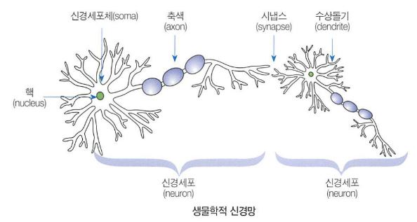
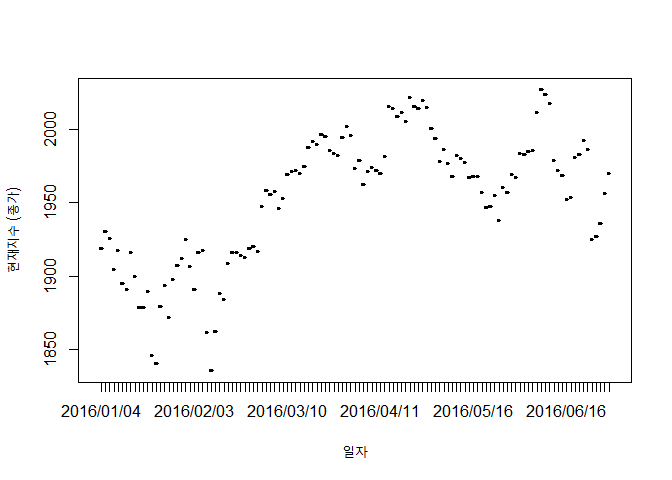
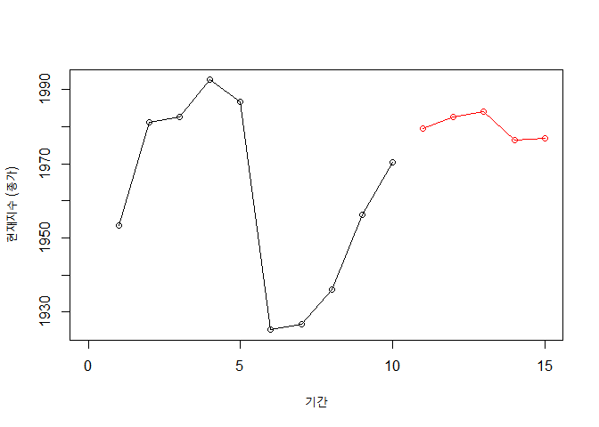

빅데이터 분석의 첫걸음 R코딩
================

-   Author: 장용식, 최진호
-   Book:
    <a href="https://book.naver.com/bookdb/book_detail.nhn?bid=16324211" class="uri">https://book.naver.com/bookdb/book_detail.nhn?bid=16324211</a>
-   coding은 example들을 제외하고는 programming으로 넘겼습니다.

------------------------------------------------------------------------

## 14. 인공지능과 인공 신경망

|   인공지능    | 분류                                                      |
|:-------------:|-----------------------------------------------------------|
| 전문가 시스템 | 지식 체계를 if then else의 규칙으로 전부 표현하고자 함.   |
|   퍼지 이론   | 자연언어에서의 애매모호함을 정량적으로 표현하고자 함.     |
|  *기계 학습*  | 컴퓨터에 인공적인 학습이 가능한 지능을 부여               |
| 유전 알고리즘 | 자연의 진화 과정으로 특정한 문제의 적절한 답을 찾고자 함. |



<br />

-   은닉층 (hidden layer): 입력층과 출력층 사이 층
-   심층(deep) 신경망: 은닉층이 2개 이상
-   인공 신경망 모형 구조 정의 → 시계열 데이터 읽기 → 테스트 → 최적 모형
    선정 → 예측

<br />

#### addition: 시계열 데이터 예측을 위한 인공 신경망 모형

1.  1단계 예측: 바로 다음 시점의 출력을 예측
2.  다단계 예측: 다수 값을 한꺼번에 예측

------------------------------------------------------------------------

### 본격적으로

``` r
# install.packages("xlsx")
# install.packages("nnet")
library(xlsx)
```

    ## Warning: package 'xlsx' was built under R version 3.6.3

``` r
library(nnet)
```

    ## Warning: package 'nnet' was built under R version 3.6.3

### 1. 구조 정의

-   입력 노드: 10, 출력 노드: 5
-   은닉층: 1, 은닉 노드: 20
-   반복 횟수: 500

``` r
inputs = 10; outputs = 5
hidden_layers = 1
hiddens = inputs * 2
iterations = 500
```

### 2. 데이터 읽기

-   데이터 출처: 한국 거래소, 주가지수 KOSPI 시리즈 20160101 \~ 20160630
-   <a href="http://marketdata.krx.co.kr/mdi#a110dc6b3a1678330158473e0d0ffbf0=2" class="uri">http://marketdata.krx.co.kr/mdi#a110dc6b3a1678330158473e0d0ffbf0=2</a>

``` r
data = read.xlsx2(file.choose(), 1)
head(data)
```

    ##         일자 현재지수   대비 등락률... 배당수익률... 주가이익비율 주가자산비율
    ## 1 2016/01/04 1,918.76 -42.55     -2.17          1.36        14.74         1.08
    ## 2 2016/01/05 1,930.53  11.77      0.61          1.35        14.83         1.08
    ## 3 2016/01/06 1,925.43  -5.10     -0.26          1.35        14.79         1.08
    ## 4 2016/01/07 1,904.33 -21.10     -1.10          1.37        14.63         1.07
    ## 5 2016/01/08 1,917.62  13.29      0.70          1.36        14.73         1.08
    ## 6 2016/01/11 1,894.84 -22.78     -1.19          1.38        14.55         1.06
    ##   시가지수 고가지수 저가지수 거래량.천주. 거래대금.백만원. 상장시가총액.백만원.
    ## 1 1,954.47 1,954.52 1,918.76      359,018        3,966,274        1,215,384,387
    ## 2 1,911.93 1,937.57 1,911.93      446,549        4,197,594        1,222,621,740
    ## 3 1,934.25 1,934.25 1,911.61      594,613        6,274,717        1,219,296,930
    ## 4 1,915.71 1,926.41 1,901.24      393,042        5,003,025        1,205,546,062
    ## 5 1,889.42 1,918.25 1,883.82      430,204        5,205,454        1,213,738,733
    ## 6 1,897.18 1,907.43 1,892.69      328,768        4,509,490        1,199,940,483

``` r
data$현재지수 = gsub(",", "", data$현재지수)
data$현재지수 = as.numeric(data$현재지수)
head(data)
```

    ##         일자 현재지수   대비 등락률... 배당수익률... 주가이익비율 주가자산비율
    ## 1 2016/01/04  1918.76 -42.55     -2.17          1.36        14.74         1.08
    ## 2 2016/01/05  1930.53  11.77      0.61          1.35        14.83         1.08
    ## 3 2016/01/06  1925.43  -5.10     -0.26          1.35        14.79         1.08
    ## 4 2016/01/07  1904.33 -21.10     -1.10          1.37        14.63         1.07
    ## 5 2016/01/08  1917.62  13.29      0.70          1.36        14.73         1.08
    ## 6 2016/01/11  1894.84 -22.78     -1.19          1.38        14.55         1.06
    ##   시가지수 고가지수 저가지수 거래량.천주. 거래대금.백만원. 상장시가총액.백만원.
    ## 1 1,954.47 1,954.52 1,918.76      359,018        3,966,274        1,215,384,387
    ## 2 1,911.93 1,937.57 1,911.93      446,549        4,197,594        1,222,621,740
    ## 3 1,934.25 1,934.25 1,911.61      594,613        6,274,717        1,219,296,930
    ## 4 1,915.71 1,926.41 1,901.24      393,042        5,003,025        1,205,546,062
    ## 5 1,889.42 1,918.25 1,883.82      430,204        5,205,454        1,213,738,733
    ## 6 1,897.18 1,907.43 1,892.69      328,768        4,509,490        1,199,940,483

#### 데이터 전체 확인

``` r
attach(data)
plot(일자, 현재지수, xlab = "일자", ylab = "현재지수 (종가)", type = 'o')
```



### 3. 테스트

-   train: 1-116 vs test: 117-121
-   입력: (1-10), (1-11), (2-12), (3-13), …, (102-111)
-   출력: (11-15), (12-16), (13-17), (14-18), …, (112-116)
-   오류율 MAPE (Mean Absolute Percentage Error) 채택

근데 이러면 가중치 평균의 정의에 따라 극으로 갈수록 가중치가 작아지는
데?<br /> 물론 많아야 9 \* 2개 정도겠지만, MA 모형 같은 느낌입니다?

``` r
getDataSet = function(item, from, to, size) {
  dataframe = NULL
  to = to - size + 1
  for (i in from:to) {
    end = i + size - 1
    temp = item[c(i:end)]
    dataframe = rbind(dataframe, t(temp))
  }
  return(dataframe)
}
```

``` r
trainX = getDataSet(현재지수, 1, 111, inputs)
trainY = getDataSet(현재지수, 11, 116, outputs)
testX = getDataSet(현재지수, 107, 116, inputs)
testY = getDataSet(현재지수, 117, 121, outputs)

(dim(trainX)[1] == dim(trainY)[1]) & (dim(testX)[1] == dim(testY)[1])
```

    ## [1] TRUE

#### 학습

``` r
model = nnet(trainX, trainY, size = hiddens, linout = TRUE, rang = 0.1, skip = TRUE, maxit = iterations)
```

    ## # weights:  375
    ## initial  value 1635153443.800208 
    ## iter  10 value 124200117.766103
    ## iter  20 value 48522935.052226
    ## iter  30 value 35070548.634349
    ## iter  40 value 5284596.887213
    ## iter  50 value 238890.242080
    ## final  value 238845.604916 
    ## converged

``` r
predictions = predict(model, testX, type = "raw")
mean(abs(predictions - testY) / testY) * 100
```

    ## [1] 1.996085

### 5. 예측

-   4번은 분석가 재량으로 패스

``` r
forecasting = getDataSet(현재지수, 112, 121, inputs)
predictions = predict(model, forecasting, type = "raw")
predictions
```

    ##          [,1]     [,2]     [,3]    [,4]     [,5]
    ## [1,] 1979.478 1982.596 1984.069 1976.44 1976.824

``` r
plot(1:10, 현재지수[112:121], xlab = "기간", ylab = "현재지수 (종가)",
     xlim = c(0, 15), type = 'o')
lines(11:15, predictions, type = 'o', col = "red")
```


