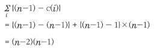
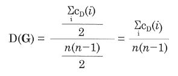
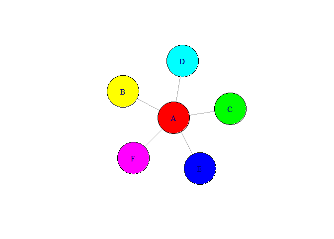
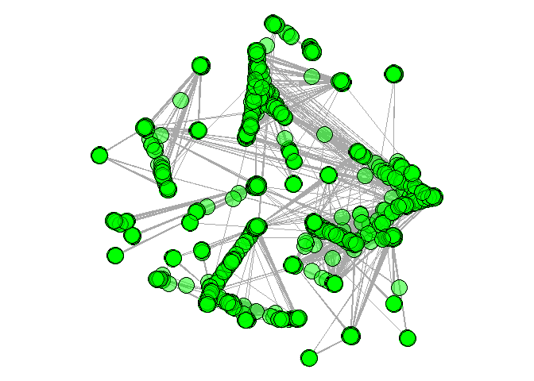
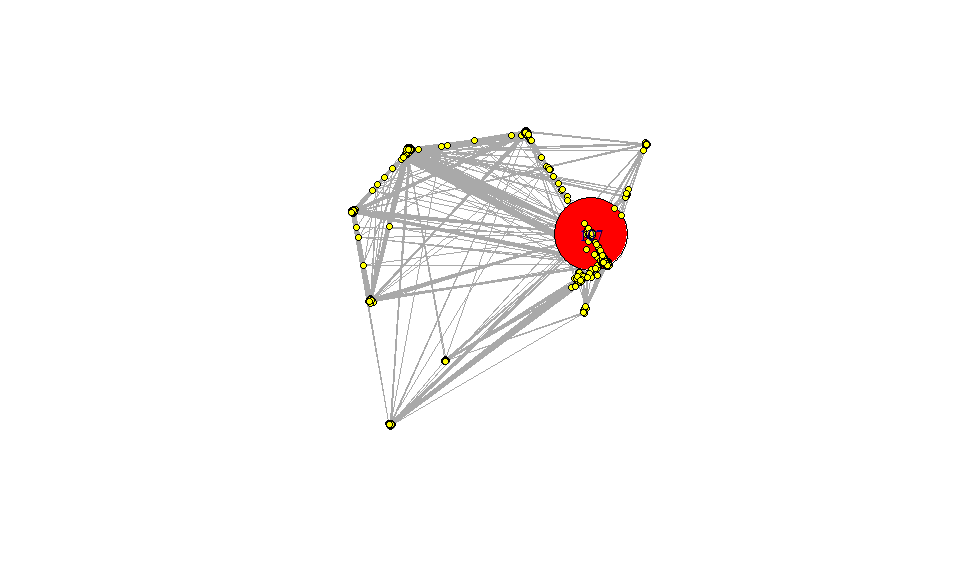
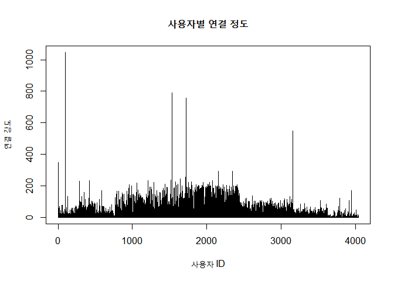
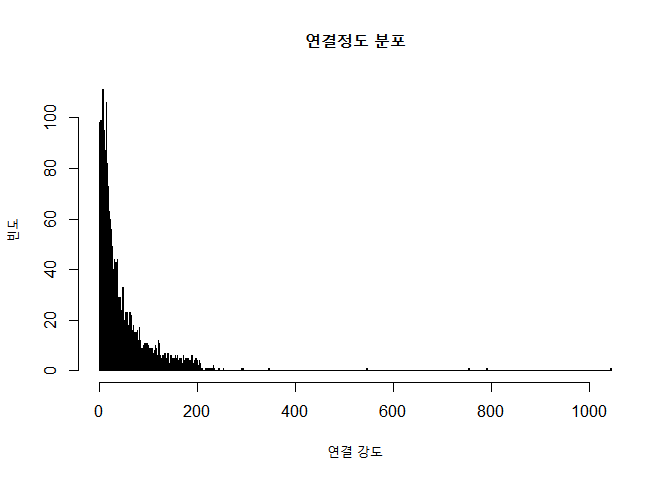
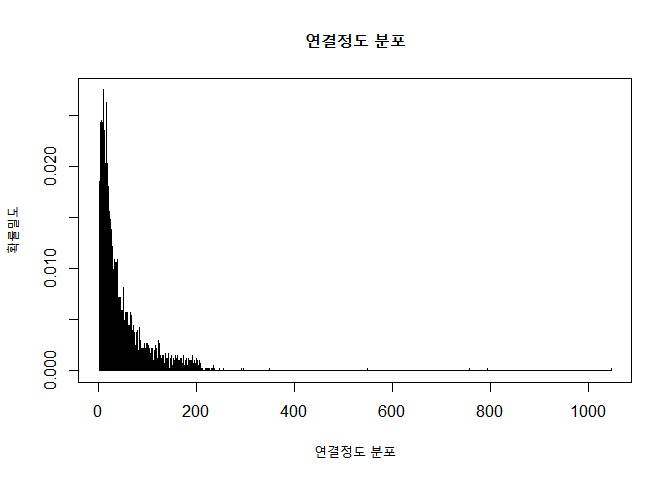
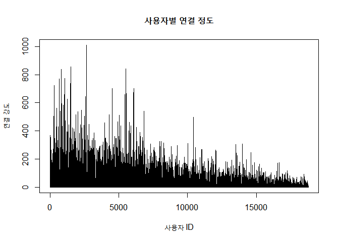
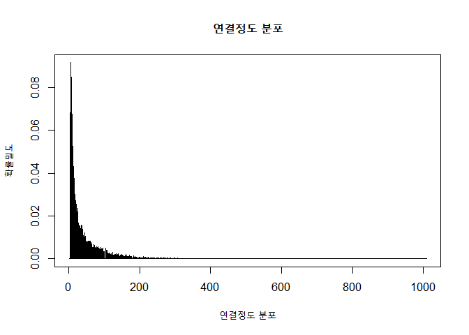

# 빅데이터 분석의 첫걸음 R코딩

- Author: 장용식, 최진호
- Book: <https://book.naver.com/bookdb/book_detail.nhn?bid=16324211>
- coding은 example들을 제외하고는 programming으로 넘겼습니다.

---

## 11\. 네트워크 분석

> 네트워크 분석(Network Analysis)은 사회 및 자연 현상들을 네트워크 형태로 모델링하여 그 특성을 분석하는 학문이다.

- 가중 그래프 (weighted graph)에 해당
- 스타형(star), Y자형, 원형(circle)
- 네트워크로 구성되는 각 지점 간의 최소 경로를 찾는 최적화 문제는 물론, 친구 관계, 협업 관계, 인터넷 연결망 구조,
  웹의 연결, 질병 전파, 분자 그래프 등으로 표현되는 다양한 사회 및 자연 현상을 파악하는데 응용되고 있다.
- 사회 연결망 분석 (Social Network Analysis)
- [연결 정도](#1.%20연결%20정도), [근접](#2.%20근접), [중개](#3.%20중개), [밀도](#밀도%20density), [최단 경로](#최단%20경로와%20거리%20geodesic%20path)

### 중심에 대하여

|  구분  |                지표                 |                      정규화된 지표                       |
| :----: | :---------------------------------: | :------------------------------------------------------: |
| 중심성 |             <i>c(i)</i>             |             <i>c(i)’ = c(i) / max(c(i))</i>              |
| 중심화 | <i>C(G) = sum(max(c(i)) - c(i))</i> | <i>C(G)’ = C(G) / max(C(G)) = C(G) / T<sub>max</sub></i> |

- 네트워크 중심화 경향은 연결정도, 근접, 중개 관점 모두에서 _스타형 \> Y자형 \> 원형_ 순서로 나타난다.

#### 1\. 연결 정도

- 연결정도 중심성 (degree centrality): <i>c<sub>D</sub>(i)</i>, 각 노드가 어느 정도로
  많든 관계를 맺고 있는지를 나타내는 지표
- 방향성이 없는 연결의 경우, 각 노드가 이론적으로 연결 가능한 최대 연결정도: <i>C<sub>D, max</sub> =
  (n-1)</i>
- 이론적으로 연결정도 중심화 값이 최대가 되기 위해서는 연결정도 중심성의 최대와 최소 값의 차이를 가장 크게 하는 구조이다.
  즉 star형일 때 그런 현상이 나타나게 된다.



|  구분  |                                  지표                                   |                       정규화된 지표                        |
| :----: | :---------------------------------------------------------------------: | :--------------------------------------------------------: |
| 중심성 |                         <i>c<sub>D</sub>(i)</i>                         |    <i>c<sub>D</sub>(i)’ = c<sub>D</sub>(i) / (n-1)</i>     |
| 중심화 | <i>C<sub>D</sub>(G) = sum(max(c<sub>D</sub>(i)) - c<sub>D</sub>(i))</i> | <i>C<sub>D</sub>(G)’ = C<sub>D</sub>(G) / {(n-1)(n-2)}</i> |

- [네트워크 구조별 연결정도 비교](images/degree_of_structures_of_network.JPG)

#### 2\. 근접

- 근접 중심성 (closeness centrality): <i>c<sub>c</sub>(i)</i>, 한 점이 다른 모든
  점들에 얼마나 가까운가를 나타내는 지표
- 직접 연결(1촌)만으로 네트워크의 영향력을 파악하는 연결정도 중심성의 한계를 보완하기 위한 것이다.
- 노드 <i>i</i>에서 <i>j</i>까지의 거리가 멀면 근접성은 떨어지게 된다.
- 이론적인 최대 근접 중심성: <i>c<sub>c, max</sub> = 1/ (n-1)</i>
- 이론적으로 가능한 근접 중심화의 최댓값: <i>T<sub>c, max</sub> = (n-2) / (2n-3)</i>

|  구분  |                                  지표                                   |                                                     정규화된 지표                                                      |
| :----: | :---------------------------------------------------------------------: | :--------------------------------------------------------------------------------------------------------------------: |
| 중심성 |      <i>c<sub>c</sub>(i) = 1/ sum<sub>j</sub>(d<sub>ij</sub>)</i>       | <i>c<sub>c</sub>(i)’ = (1/ sum<sub>j</sub>(d<sub>ij</sub>)) / (1/ (n-1)) = (n-1) / sum<sub>j</sub>(d<sub>ij</sub>)</i> |
| 중심화 | <i>C<sub>c</sub>(G) = sum(max(c<sub>c</sub>(i)) - c<sub>c</sub>(i))</i> |                             <i>C<sub>c</sub>(G)’ = C<sub>c</sub>(G) / {(n-2) / (2n-3)}</i>                             |

- [네트워크 구조별 근접 정도 비교](images/closeness_of_structures_of_network.JPG)

#### 3\. 중개

- 중개 중심성 (betweenness centrality): 연결망에서 한 노드가 다른 노드들 사이에 위치하는 정도를
  나타내는 지표
- 중개 노드<i>(i)</i>의 중개 중심성은 임의의 다른 두 노드들<i>(j,k)</i>이 중개 노드<i>(i)</i>를
  거치는 최단거리 경로의 수 <i>g<sub>jk</sub></i>
- 임의 노드 <i>i</i>를 거치는 이론적인 최대 중개 중심성: <i>c<sub>B, max</sub> =
  (n-1)(n-2) /2</i>
- 이론적으로 가능한 중개 중심화의 최댓값: <i>T<sub>B, max</sub> =
  (n-1)<sup>2</sup>(n-2) /2</i>

|  구분  |                                        지표                                         |                               정규화된 지표                               |
| :----: | :---------------------------------------------------------------------------------: | :-----------------------------------------------------------------------: |
| 중심성 | <i>c<sub>B</sub>(i) = sum<sub>j \< k</sub> (g<sub>jk</sub>(i) / g<sub>jk</sub>)</i> |       <i>c<sub>B</sub>(i)’ = c<sub>B</sub>(i) / {(n-1)(n-2) /2}</i>       |
| 중심화 |       <i>C<sub>B</sub>(G) = sum(max(c<sub>B</sub>(i)) - c<sub>B</sub>(i))</i>       | <i>C<sub>B</sub>(G)’ = C<sub>B</sub>(G) / {(n-1)<sup>2</sup>(n-2) /2}</i> |

- [네트워크 구조별 중개 정도](images/betweenness_of_structures_of_network.JPG)

### 밀도 (density)

- 네트워크에서 이론적으로 연결 가능한 최대 연결 수 대비 실제 얼마나 많은 관계를 맺고 있는가를 상대적인 비율로 나타내는
  지표
- <i>n</i>개의 노드로 구성되는 네트워크에서 각 노드는 <i>n-1</i>개의 연결이 가능하며, 총 연결 수는
  <i>n(n-1)</i>개가 된다.



### 최단 경로와 거리 (geodesic path)

- 최단 경로: 두 노드 간 가장 짧은 연결 경로
- 거리: 경로 상의 연결 수
- 네트워크 상의 임의 두 노드 간 거리의 전체 경향을 파악하기 위해 모든 노드 간 거리를 평균한 평균거리를 파악한다.

---

### 실행해보기

```r
## install.packages("igraph")
library(igraph)
```

#### 1\. star

```r
G.star <- make_star(6, mode = "undirected", center = 1) %>%
          set_vertex_attr("name", value = c('A', 'B', 'C', 'D', 'E', 'F'))
plot(G.star, vertex.color = rainbow(6), vertex.size = 60)
```



```r
tkplot(G.star, vertex.color = rainbow(6), vertex.size = 20)
```

    ## [1] 1

- interactive graph는 새 창을 통한 띄우기로 이미지로 처리되지 않는다.

#### 2\. circle

```r
G.ring <- make_ring(6, directed = F, circular = T) %>%
          set_vertex_attr("name", value = c('A', 'B', 'C', 'D', 'E', 'F'))
tkplot(G.ring, vertex.color = rainbow(6), vertex.size = 20)
```

    ## [1] 2

- interactive graph는 새 창을 통한 띄우기로 이미지로 처리되지 않는다.

#### 3\. Y

```r
G.Y <- make_graph(edges = NULL, n = NULL, directed = F)
G.Y <- G.Y + vertices('A', 'B', 'C', 'D', 'E', 'F')
G.Y <- G.Y + edges('A', 'B', 'A', 'C', 'A', 'D', 'D', 'E', 'E', 'F')
tkplot(G.Y, vertex.color = rainbow(6), vertex.size = 20)
```

    ## [1] 3

- interactive graph는 새 창을 통한 띄우기로 이미지로 처리되지 않는다.

#### 중심성과 중심화 값

```r
degree(G.star, normalized = F)
```

    ## A B C D E F
    ## 5 1 1 1 1 1

```r
degree(G.star, normalized = T)
```

    ##   A   B   C   D   E   F
    ## 1.0 0.2 0.2 0.2 0.2 0.2

```r
CD <- centralization.degree(G.star, normalized = F)
CD
```

    ## $res
    ## [1] 5 1 1 1 1 1
    ##
    ## $centralization
    ## [1] 20
    ##
    ## $theoretical_max
    ## [1] 30

- 이론적인 연결정도 중심화가 igraph 패키지 오류로 다를 수 있다.

<!-- end list -->

```r
Tmax <- centralization.degree.tmax(G.ring)
CD$centralization / Tmax
```

    ## [1] 1

#### 근접 중심성과 중심화

```r
closeness(G.star, normalized = F)
```

    ##         A         B         C         D         E         F
    ## 0.2000000 0.1111111 0.1111111 0.1111111 0.1111111 0.1111111

```r
closeness(G.star, normalized = T)
```

    ##         A         B         C         D         E         F
    ## 1.0000000 0.5555556 0.5555556 0.5555556 0.5555556 0.5555556

```r
CC <- centralization.closeness(G.star, normalized = F)
CC$theretical_max / (6 - 1)
```

    ## numeric(0)

- 이론적인 최대 근접 중심화, igraph 패키지 오류로 (노드수 - 1)로 나눠야 한다.

<!-- end list -->

```r
CC$centralization / CC$theoretical_max
```

    ## [1] 1

#### 중개 중심성과 중심화

```r
betweenness(G.star, normalized = F)
```

    ##  A  B  C  D  E  F
    ## 10  0  0  0  0  0

```r
betweenness(G.star, normalized = T)
```

    ## A B C D E F
    ## 1 0 0 0 0 0

```r
CB <- centralization.betweenness(G.star, normalized = F)
CB$centralization
```

    ## [1] 50

```r
CB$theoretical_max
```

    ## [1] 50

```r
CB$centralization / CB$theoretical_max
```

    ## [1] 1

#### 네트워크 밀도

```r
graph.density(G.star)
```

    ## [1] 0.3333333

```r
graph.density(G.Y)
```

    ## [1] 0.3333333

```r
graph.density(G.ring)
```

    ## [1] 0.4

#### 최단 경로와 평균 거리

```r
shortest.paths(G.Y)
```

    ##   A B C D E F
    ## A 0 1 1 1 2 3
    ## B 1 0 2 2 3 4
    ## C 1 2 0 2 3 4
    ## D 1 2 2 0 1 2
    ## E 2 3 3 1 0 1
    ## F 3 4 4 2 1 0

```r
distances(G.Y, v = 'A', to = 'E')
```

    ##   E
    ## A 2

```r
get.shortest.paths(G.Y, 'A', 'E')$vpath[[1]]
```

    ## + 3/6 vertices, named, from 7b47453:
    ## [1] A D E

```r
average.path.length(G.Y)
```

    ## [1] 2.133333

---

### 페이스북 사용자 네트워크 분석

- facebook_combined.txt in Social networks of Stanford Large Network
  Dataset Collection
- <https://snap.stanford.edu>

<!-- end list -->

```r
## library(igraph)
df.fb <- read.table(file.choose(), header = F)
head(df.fb)
```

    ##   V1 V2
    ## 1  0  1
    ## 2  0  2
    ## 3  0  3
    ## 4  0  4
    ## 5  0  5
    ## 6  0  6

```r
tail(df.fb)
```

    ##         V1   V2
    ## 88229 4023 4038
    ## 88230 4026 4030
    ## 88231 4027 4031
    ## 88232 4027 4032
    ## 88233 4027 4038
    ## 88234 4031 4038

```r
G.fb <- graph.data.frame(df.fb, directed = F)
par(mar = c(0,0,0,0))
plot(G.fb, vertex.label = NA, vertex.size = 10, vertex.color = rgb(0,1,0,0.5))
```



```r
## dev.off()
```

너무 많고 복잡하니까 작게 그려보자.

```r
dim(V(G.fb)$name)
```

    ## NULL

```r
v.set <- V(G.fb)$name[1:50]
G.fb.part <- induced_subgraph(G.fb, v = v.set)
tkplot(G.fb.part, vertex.label.cex = 1.2, vertex.size = degree(G.fb.part)*1.5,
       vertex.color = "yellow", vertex.frame.color = "gray")
```

    ## [1] 4

- interactive graph는 새 창을 통한 띄우기로 이미지로 처리되지 않는다.

<!-- end list -->

```r
v2 <- which(V(G.fb)$name == '1')
v2
```

    ## [1] 2

```r
v.set <- neighbors(G.fb, v = v2)
v.set
```

    ## + 17/4039 vertices, named, from 8b474ed:
    ##  [1] 0   48  53  54  73  88  92  119 126 133 194 236 280 299 315 322 346

```r
v3 <- c(v2, v.set)
G.fb.id <- induced_subgraph(G.fb, v = v3)
V(G.fb.id)$color <- ifelse(V(G.fb.id)$name == '1', "red", "yellow")
tkplot(G.fb.id, vertex.label.cex = 1.2, vertex.size = degree(G.fb.id)*1.5, vertex.frame.color = "gray")
```

    ## [1] 5

- interactive graph는 새 창을 통한 띄우기로 이미지로 처리되지 않는다.

#### 연결정도가 가장 큰 사용자와 연결된 그래프

```r
v.max <- V(G.fb)$name[degree(G.fb) == max(degree(G.fb))]
v.max
```

    ## [1] "107"

```r
degree(G.fb, v.max)
```

    ##  107
    ## 1045

```r
v.max.idx <- which(V(G.fb)$name == v.max)
v.max.idx
```

    ## [1] 100

```r
v.set <- neighbors(G.fb, v = v.max.idx)
v3 <- c(v.max.idx, v.set)
G.fb_2 <- induced_subgraph(G.fb, v = v3)
V(G.fb_2)$color <- ifelse(V(G.fb_2)$name == v.max, "red", "yellow")
V(G.fb_2)$label <- ifelse(V(G.fb_2)$name == v.max, v.max, NA)
V(G.fb_2)$size <- ifelse(V(G.fb_2)$name == v.max, 50, 5)
plot(G.fb_2)
```



#### 중심성과 중심화 분석

1.  연결 정도

<!-- end list -->

```r
summary(degree(G.fb, normalized = F))
```

    ##    Min. 1st Qu.  Median    Mean 3rd Qu.    Max.
    ##    1.00   11.00   25.00   43.69   57.00 1045.00

```r
summary(degree(G.fb, normalized = T))
```

    ##      Min.   1st Qu.    Median      Mean   3rd Qu.      Max.
    ## 0.0002476 0.0027241 0.0061912 0.0108200 0.0141159 0.2587915

```r
CD <- centralization.degree(G.fb, normalized = F)
CD$centralization
```

    ## [1] 4044287

```r
Tmax <- centralization.degree.tmax(G.fb)
Tmax
```

    ## [1] 16301406

```r
CD$centralization / Tmax
```

    ## [1] 0.2480944

2.  근접

<!-- end list -->

```r
summary(closeness(G.fb, normalized = F))
```

    ##      Min.   1st Qu.    Median      Mean   3rd Qu.      Max.
    ## 4.414e-05 6.447e-05 6.995e-05 6.839e-05 7.801e-05 1.138e-04

```r
summary(closeness(G.fb, normalized = T))
```

    ##    Min. 1st Qu.  Median    Mean 3rd Qu.    Max.
    ##  0.1783  0.2603  0.2825  0.2762  0.3150  0.4597

```r
CC <- centralization.closeness(G.fb, normalized = F)
n <- vcount(G.fb)
n
```

    ## [1] 4039

```r
CC$centralization / (n-1)
```

    ## [1] 0.1835771

```r
CC$theoretical_max / (n-1)
```

    ## [1] 0.4999381

```r
CC$centralization / CC$theoretical_max
```

    ## [1] 0.3671998

3.  중개

<!-- end list -->

```r
summary(betweenness(G.fb, normalized = F))
```

    ##    Min. 1st Qu.  Median    Mean 3rd Qu.    Max.
    ##       0       3      24    5436     124 3916560

```r
summary(betweenness(G.fb, normalized = T))
```

    ##      Min.   1st Qu.    Median      Mean   3rd Qu.      Max.
    ## 0.0000000 0.0000004 0.0000029 0.0006670 0.0000152 0.4805181

```r
CB <- centralization.betweenness(G.fb, normalized = F)
CB$centralization
```

    ## [1] 15797029727

```r
CB$theoretical_max
```

    ## [1] 32912538714

```r
CB$centralization / CB$theoretical_max
```

    ## [1] 0.47997

4.  밀도

<!-- end list -->

```r
graph.density(G.fb)
```

    ## [1] 0.01081996

5.  노드 간 거리와 평균거리

<!-- end list -->

```r
shortest.paths(G.fb)[1:10, 1:10]
```

    ##   0 1 2 3 4 5 6 7 8 9
    ## 0 0 1 1 1 1 1 1 1 1 1
    ## 1 1 0 2 2 2 2 2 2 2 2
    ## 2 1 2 0 2 2 2 2 2 2 2
    ## 3 1 2 2 0 2 2 2 2 2 1
    ## 4 1 2 2 2 0 2 2 2 2 2
    ## 5 1 2 2 2 2 0 2 2 2 2
    ## 6 1 2 2 2 2 2 0 2 2 2
    ## 7 1 2 2 2 2 2 2 0 2 2
    ## 8 1 2 2 2 2 2 2 2 0 2
    ## 9 1 2 2 1 2 2 2 2 2 0

```r
distances(G.fb, v = '3', to = '7')
```

    ##   7
    ## 3 2

```r
get.shortest.paths(G.fb, '3', '7')$vpath[[1]]
```

    ## + 3/4039 vertices, named, from 8b474ed:
    ## [1] 3 0 7

```r
average.path.length(G.fb)
```

    ## [1] 3.692507

6.  확률밀도 분포

<!-- end list -->

```r
plot(degree(G.fb), xlab = "사용자 ID", ylab = "연결 강도", main = "사용자별 연결 정도", type = 'h')
```



```r
x <- degree(G.fb, normalized = F)
summary(x)
```

    ##    Min. 1st Qu.  Median    Mean 3rd Qu.    Max.
    ##    1.00   11.00   25.00   43.69   57.00 1045.00

```r
hist(x, xlab = "연결 강도", ylab = "빈도", main = "연결정도 분포", breaks = seq(0, max(x), by = 1))
```



```r
G.fb.dist <- degree.distribution(G.fb)
plot(G.fb.dist, type = 'h', xlab = "연결정도 분포", ylab = "확률밀도", main = "연결정도 분포")
```



- 이런 모양의 분포를 멱함수 분포(x-<sub>k</sub>)라고 하며, 네트워크의 많은 분포는 정규분포와는 다르게 멱함수
  분포를 띠고 있다.

---

### 연습용 project

- facebook_combined.txt in Social networks of Stanford Large Network
  Dataset Collection
- 18772 (연구자)노드, 연구자 간 396160 연결(논문연구 협업), 방향성 없는 연결

<!-- end list -->

1.  네트워크 그리기

<!-- end list -->

```r
## library(igraph)
df <- read.table(file.choose(), header = F)
head(df)
```

    ##      V1    V2
    ## 1 84424   276
    ## 2 84424  1662
    ## 3 84424  5089
    ## 4 84424  6058
    ## 5 84424  6229
    ## 6 84424 10639

```r
tail(df)
```

    ##           V1    V2
    ## 396155 49676 26325
    ## 396156 49676 50641
    ## 396157 49676 57507
    ## 396158 50641 26325
    ## 396159 50641 49676
    ## 396160 50641 57507

```r
G <- graph.data.frame(df, directed = F)
v.set <- V(G)$name[1:50]
G.part <- induced_subgraph(G, v = v.set)
tkplot(G.part, vertex.label.cex = 1.2, vertex.size = degree(G.part)*1.5,
       vertex.color = "yellow", vertex.frame.color = "gray")
```

    ## [1] 6

- interactive graph는 새 창을 통한 띄우기로 이미지로 처리되지 않는다.

<!-- end list -->

2.  연결정도 / 근접 / 중개 중심성과 중심화

<!-- end list -->

- 1.  연결 정도

<!-- end list -->

```r
summary(degree(G, normalized = F))
```

    ##    Min. 1st Qu.  Median    Mean 3rd Qu.    Max.
    ##    2.00    8.00   18.00   42.21   54.00 1008.00

```r
summary(degree(G, normalized = T))
```

    ##      Min.   1st Qu.    Median      Mean   3rd Qu.      Max.
    ## 0.0001066 0.0004262 0.0009589 0.0022486 0.0028768 0.0536999

```r
CD <- centralization.degree(G, normalized = F)
CD$centralization
```

    ## [1] 18129856

```r
Tmax <- centralization.degree.tmax(G)
Tmax
```

    ## [1] 352331670

```r
CD$centralization / Tmax
```

    ## [1] 0.05145679

- 2.  근접

<!-- end list -->

```r
summary(closeness(G, normalized = F))
```

    ## Warning in closeness(G, normalized = F): At centrality.c:2784 :closeness
    ## centrality is not well-defined for disconnected graphs

    ##      Min.   1st Qu.    Median      Mean   3rd Qu.      Max.
    ## 2.838e-09 6.099e-08 6.103e-08 5.833e-08 6.105e-08 6.111e-08

```r
summary(closeness(G, normalized = T))
```

    ## Warning in closeness(G, normalized = T): At centrality.c:2784 :closeness
    ## centrality is not well-defined for disconnected graphs

    ##      Min.   1st Qu.    Median      Mean   3rd Qu.      Max.
    ## 5.327e-05 1.145e-03 1.146e-03 1.095e-03 1.146e-03 1.147e-03

```r
CC <- centralization.closeness(G, normalized = F)
```

    ## Warning in centralization.closeness(G, normalized = F): At centrality.c:
    ## 2784 :closeness centrality is not well-defined for disconnected graphs

```r
n <- vcount(G)
n
```

    ## [1] 18772

```r
CC$centralization / (n-1)
```

    ## [1] 5.223307e-05

```r
CC$theoretical_max / (n-1)
```

    ## [1] 0.4999867

```r
CC$centralization / CC$theoretical_max
```

    ## [1] 0.0001044689

- 3.  중개

<!-- end list -->

```r
summary(betweenness(G, normalized = F))
```

    ##    Min. 1st Qu.  Median    Mean 3rd Qu.    Max.
    ##       0       0     249   27266   17901 4260512

```r
summary(betweenness(G, normalized = T))
```

    ##      Min.   1st Qu.    Median      Mean   3rd Qu.      Max.
    ## 0.000e+00 0.000e+00 1.415e-06 1.548e-04 1.016e-04 2.418e-02

```r
CB <- centralization.betweenness(G, normalized = F)
CB$centralization
```

    ## [1] 79466482910

```r
CB$theoretical_max
```

    ## [1] 3.306809e+12

```r
CB$centralization / CB$theoretical_max
```

    ## [1] 0.02403117

3.  연결정도 분포 그리기

<!-- end list -->

```r
plot(degree(G), xlab = "사용자 ID", ylab = "연결 강도", main = "사용자별 연결 정도", type = 'h')
```



```r
x <- degree(G, normalized = F)
summary(x)
```

    ##    Min. 1st Qu.  Median    Mean 3rd Qu.    Max.
    ##    2.00    8.00   18.00   42.21   54.00 1008.00

```r
hist(x, xlab = "연결 강도", ylab = "빈도", main = "연결정도 분포", breaks = seq(0, max(x), by = 1))
```


```r
G.dist <- degree.distribution(G)
plot(G.dist, type = 'h', xlab = "연결정도 분포", ylab = "확률밀도", main = "연결정도 분포")
```



4.  많이 협업한 연구자 분석 (상위 10명)

<!-- end list -->

```r
V(G)$name[order(degree(G), decreasing = T) <= 10]
```

    ##  [1] "35946"  "59196"  "8682"   "48350"  "125425" "44512"  "17263"  "126984"
    ##  [9] "58389"  "27580"

5.  가장 많이 협업한 연구자를 중심으로 하는 연결망

<!-- end list -->

```r
v.max <- V(G)$name[degree(G) == max(degree(G))]
v.max
```

    ## [1] "53213"

```r
degree(G, v.max)
```

    ## 53213
    ##  1008

```r
v.max.idx <- which(V(G)$name == v.max)
v.max.idx
```

    ## [1] 2662

```r
v.set <- neighbors(G, v = v.max.idx)
v3 <- c(v.max.idx, v.set)
G_2 <- induced_subgraph(G, v = v3)
V(G_2)$color <- ifelse(V(G_2)$name == v.max, "red", "yellow")
V(G_2)$label <- ifelse(V(G_2)$name == v.max, v.max, NA)
V(G_2)$size <- ifelse(V(G_2)$name == v.max, 50, 5)
plot(G_2)
```


