# 빅데이터 분석의 첫걸음 R코딩

- Author: 장용식, 최진호
- Book: <https://book.naver.com/bookdb/book_detail.nhn?bid=16324211>
- coding은 example들을 제외하고는 programming으로 넘겼습니다.

---

## 5\. Chart programming

_데이터 분석결과를 효과적으로 전달하는 수단으로 차트를 사용한다._

|        |        | description                                              | 예            |
| ------ | ------ | -------------------------------------------------------- | ------------- |
| 범주형 | 명목형 | 단순히 데이터의 분류 목적                                | 성별, 지역    |
|        | 순서형 | 데이터 간의 순서가 있다                                  | 성적 등급     |
| 수치형 | 이산형 | 일정간 간격이 있는 데이터로 절대 0을 갖는다              | 근무년수      |
|        | 연속형 | 셀 수 없이 연속적인 값의 데이터로 0이 무를 뜻하지 아니다 | 키, 지진 규모 |

> 범주형 데이터를 비교할 때에는 파이 차트와 바 차트를, 수치형 데이터의 분포를 표현할 때는 산포도, 히스토그램, 박스플롯 등을
> 이용한다.

```r
library(RColorBrewer)
```

### 줄기-잎 그림 (Stem-and-Leaf plot)

```r
## rivers
stem(rivers)
```

    ##
    ##   The decimal point is 2 digit(s) to the right of the |
    ##
    ##    0 | 4
    ##    2 | 011223334555566667778888899900001111223333344455555666688888999
    ##    4 | 111222333445566779001233344567
    ##    6 | 000112233578012234468
    ##    8 | 045790018
    ##   10 | 04507
    ##   12 | 1471
    ##   14 | 56
    ##   16 | 7
    ##   18 | 9
    ##   20 |
    ##   22 | 25
    ##   24 | 3
    ##   26 |
    ##   28 |
    ##   30 |
    ##   32 |
    ##   34 |
    ##   36 | 1

```r
stem(rivers, scale = 2)
```

    ##
    ##   The decimal point is 2 digit(s) to the right of the |
    ##
    ##    1 | 4
    ##    2 | 0112233345555666677788888999
    ##    3 | 00001111223333344455555666688888999
    ##    4 | 111222333445566779
    ##    5 | 001233344567
    ##    6 | 000112233578
    ##    7 | 012234468
    ##    8 | 04579
    ##    9 | 0018
    ##   10 | 045
    ##   11 | 07
    ##   12 | 147
    ##   13 | 1
    ##   14 | 56
    ##   15 |
    ##   16 |
    ##   17 | 7
    ##   18 | 9
    ##   19 |
    ##   20 |
    ##   21 |
    ##   22 |
    ##   23 | 25
    ##   24 |
    ##   25 | 3
    ##   26 |
    ##   27 |
    ##   28 |
    ##   29 |
    ##   30 |
    ##   31 |
    ##   32 |
    ##   33 |
    ##   34 |
    ##   35 |
    ##   36 |
    ##   37 | 1

- 기본 줄기수를 sqrt(n)로 정한다고 했던가.
- 현재 줄기는 백의 자리 숫자를 잎은 반올림된 십의 자리 숫자다.

### Pie chart

```r
city <- c("서울", "부산", "대구", "인천", "광주", "대전", "울산")
pm25 <- c(18, 21, 21, 17, 8, 11, 25)
colors <- c("red", "orange", "yellow", "green", "lightblue", "blue", "violet")
pie(pm25, labels = city, col = colors, main = "지역별 초미세먼지 농도")
```

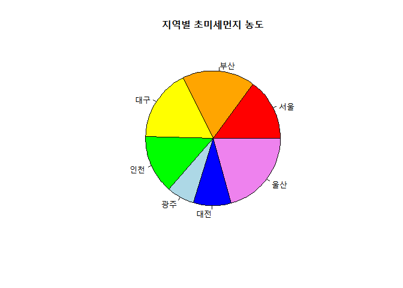

```r
pie(pm25, labels = city, col = colors, main = "지역별 초미세먼지 농도", clockwise = T)
```

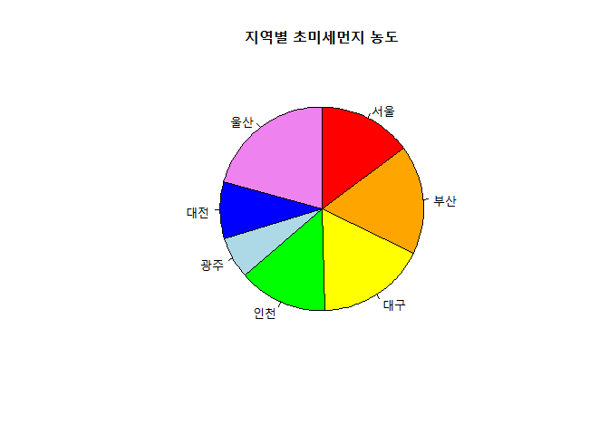

- clockwise 옵션을 이용해 시계 방향(default 3시 시작)으로 설정해보았다.

#### addition: palette

```r
## library(gdRdriver) ## package에 상관없이 해당 palette를 부를 수 있다.
x <- rep(1, 12)
```

```r
par(mfrow = c(2,3))
pie(x, labels = seq(1, 12), col = rainbow(12))
pie(x, labels = seq(1, 12), col = heat.colors(12))
pie(x, labels = seq(1, 12), col = terrain.colors(12))
pie(x, labels = seq(1, 12), col = topo.colors(12))
pie(x, labels = seq(1, 12), col = cm.colors(12))
```

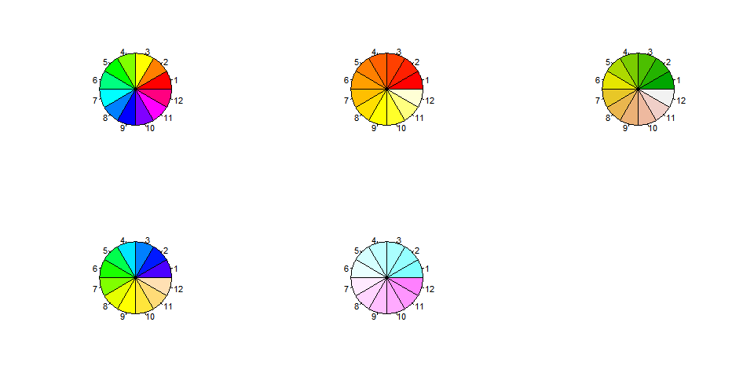

```r
library(RColorBrewer)
display.brewer.all()
display.brewer.pal(9, name = "Greens")
display.brewer.pal(6, name = "Greens")
```

> display.brewer.pal( ): 지정한 수만큼 해당 이름의 팔레트에서 뽑아온다.

```r
library(RColorBrewer)
greens <- brewer.pal(7, "Greens")
pct <- round(pm25/sum(pm25) * 100, 0)
city_label <- paste(city, ", ", pct, '%', sep = '')
```

```r
pie(pm25, labels = city_label, col = greens, main = "지역별 초미세먼지 농도", clockwise = T)
```


### Bar chart

```r
dept <- c("영업 1팀", "영업 2팀", "영업 3팀", "영업 4팀")
sales01 <- c(4, 12, 5, 8)
```

```r
barplot(sales01, names.arg = dept, main = "부서별 영업 실적(1분기)", col = rainbow(length(dept)),
        xlab = "부서", ylab = "영업 실적(억 원)", ylim = c(0, 15))
abline(h = mean(sales01), col = "orange", lty = 2)
```

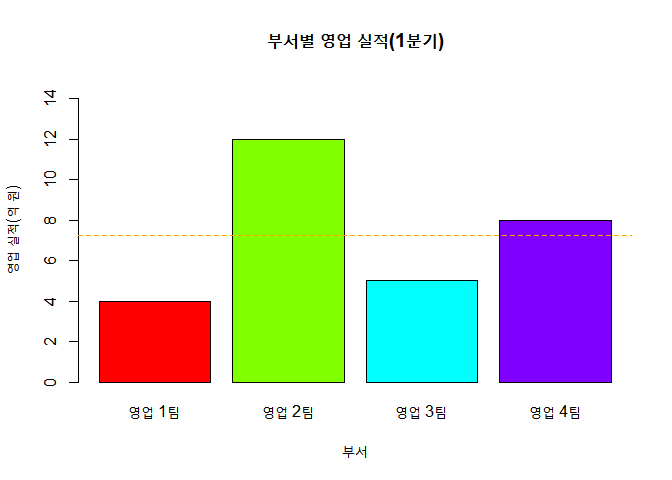

라벨 출력을 해보자.

```r
bp <- barplot(sales01, names.arg = dept, main = "부서별 영업 실적(1분기)", col = rainbow(length(dept)),
              xlab = "부서", ylab = "영업 실적(억 원)", ylim = c(0, 15))
text(bp, y = sales01, labels = sales01, pos = 3)
```

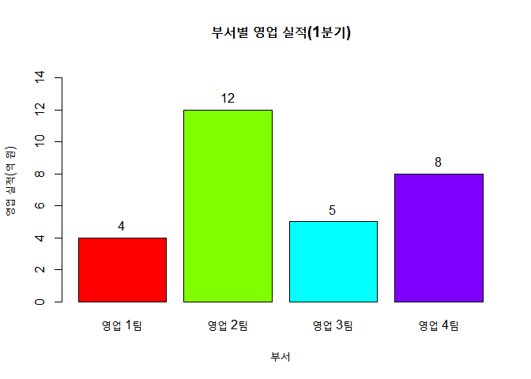

수평으로 만들어보자.

```r
barplot(sales01, names.arg = dept, main = "부서별 영업 실적(1분기)", col = rainbow(length(dept)),
        ylab = "부서", xlab = "영업 실적(억 원)", xlim = c(0, 15), horiz = T)
```

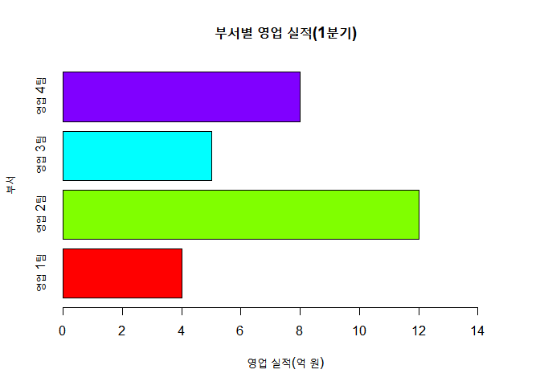

스택형 bar plot

```r
sales02 <- c(12, 8, 8, 4)
sales <- rbind(sales01, sales02)
sales
```

    ##         [,1] [,2] [,3] [,4]
    ## sales01    4   12    5    8
    ## sales02   12    8    8    4

범례의 위치가 차트 위인 경우, 오른쪽인 경우

```r
legend_lbl <- c("1분기", "2분기")
par(mfrow = c(1,2))
barplot(sales, main = "부서별 영업 실적(1~2 분기)", names.arg = dept, xlab = "부서", ylab = "영업 실적(억 원)",
        col = c("green", "orange"), legend.text = legend_lbl, ylim = c(0, 30),
        args.legend = list(x = "top", ncol = 2))
barplot(sales, main = "부서별 영업 실적(1~2 분기)", names.arg = dept, xlab = "부서", ylab = "영업 실적(억 원)",
        col = c("green", "orange"), legend.text = legend_lbl, xlim = c(0, 7),  args.legend = list(x = "right"))
```

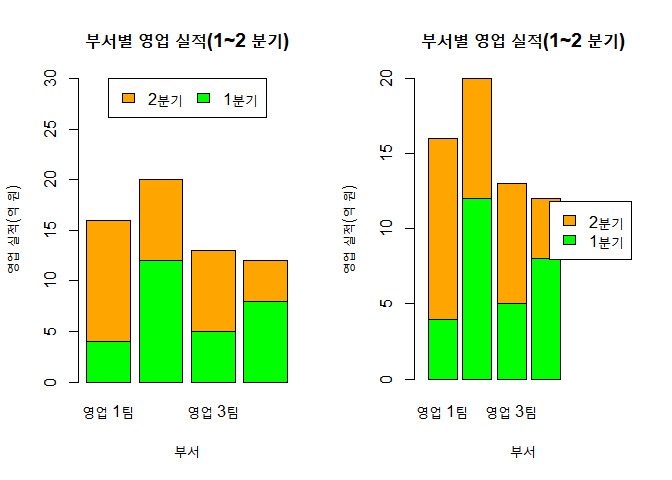

그룹형 차트 + 차트 밖에 위치한 범례

```r
barplot(sales, main = "부서별 영업 실적(1~2 분기)", names.arg = dept, xlab = "부서", ylab = "영업 실적(억 원)",
        col = c("green", "orange"), legend.text = legend_lbl, xlim = c(0, 17), args.legend = list(x = "right"),
        beside = T)
```

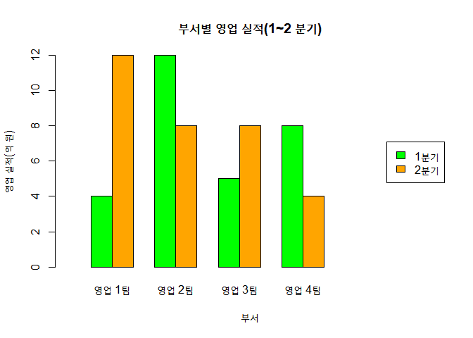

### X-Y plotting

```r
plot(women$height, women$weight, xlab = "키", ylab = "몸무게", main = "키와 몸무게의 변화")
```

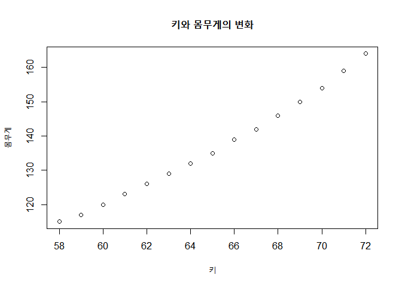

pch를 변환시켜보자.

```r
plot(women$height, women$weight, xlab = "키", ylab = "몸무게", main = "키와 몸무게의 변화", pch = 23,
     col = "blue", bg = "yellow", cex = 1.5)
```

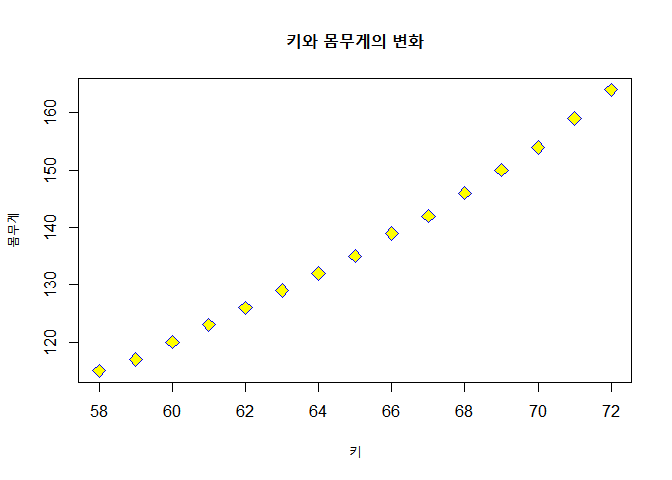

```r
plot(women$height, women$weight, xlab = "키", ylab = "몸무게", type = "p")
```

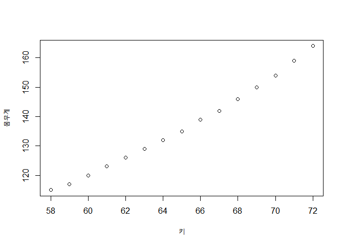

| type | desciption              | type | desciption            |
| :--: | ----------------------- | :--: | --------------------- |
|  p   | point                   |  l   | line                  |
|  b   | point & line            |  c   | only line from b      |
|  o   | alike b                 |  h   | show graphical height |
|  s   | like Gauss’s stair plot |  S   | alike s               |
|  n   | none                    |      |                       |

lwd를 다르게 설정해보자.

```r
plot(women$height, women$width, xlab = "키", ylab = "몸무게", type = "l", lty = 1, lwd = 1)
```

축의 출력 범위 제어

```r
plot(women$height, women$weight, xlim = c(0, max(women$height)), ylim = c(0 ,max(women$weight)), xlab = "키",
     ylab = "몸무게", main = "키와 몸무게의 변화", pch = 23, col = "blue", bg = "yellow", cex = 1.5)
```

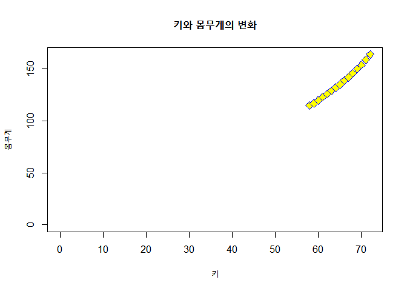

- 보면 알겠지만, 축 출력 범위에 따라 그래프의 모양이 다르게 보일 수 있다.

### Histogram

계급 구간을 설정해 막대 수를 줄여보자.

```r
par(mfrow = c(1,2))
hist(quakes$mag, col = rainbow(10), xlab = "지진 강도", ylab = "발생 건수", main = "지진 발생 강도의 분포")
hist(quakes$mag, breaks = seq(4, 6.5, 0.5), col = rainbow(10), xlab = "지진 강도", ylab = "발생 건수",
     main = "지진 발생 강도의 분포")
```

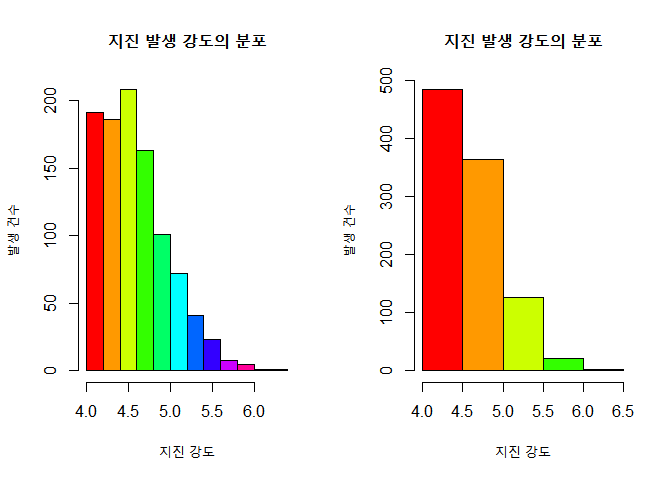

| 계급 수 공식 |                       |
| :----------: | --------------------- |
|   Sturges    | ceil(1 + 3.3\*log(n)) |
|     Rice     | ceil(2\*n^10)         |

확률 밀도로 그린 histogram (default histogram)

```r
hist(quakes$mag, freq = F, col = rainbow(10), xlab = "지진 강도", ylab = "확률 밀도", main = "지진 발생 강도의 분포")
lines(density(quakes$mag), lwd = 2)
```

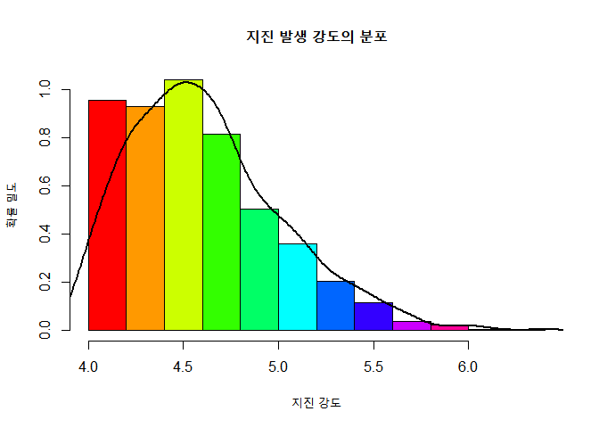

- 확률 밀도이므로 당연히 막대 넓이의 합은 1이다.

### Box plot

```r
boxplot(quakes$mag, col = "lightblue", xlab = "지진", ylab = "지진 규모",
        main = "지진 발생 강도의 분포")
```

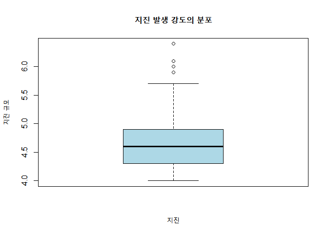

- IF (inner fence): Q3(or Q1) ± 1.5\*(Q3 - Q1)
- OF (outer fence): Q3(or Q1) ± 2\*(Q3 - Q1)

quakes\$mag 다섯 숫자 요약 보기

```r
min(quakes$mag);  median(quakes$mag);  max(quakes$mag)
```

    ## [1] 4

    ## [1] 4.6

    ## [1] 6.4

```r
Q <- quantile(quakes$mag)
Q
```

    ##   0%  25%  50%  75% 100%
    ##  4.0  4.3  4.6  4.9  6.4

```r
Q[3] - Q[1]; IQR(quakes$mag)
```

    ## 50%
    ## 0.6

    ## [1] 0.6

```r
fence.upper <- Q[3] + 1.5 * IQR(quakes$mag)
fence.lower <- Q[1] - 1.5 * IQR(quakes$mag)
fence.upper;  fence.lower
```

    ## 50%
    ## 5.5

    ##  0%
    ## 3.1

```r
quakes$mag[quakes$mag > fence.upper]
```

    ##  [1] 6.1 6.0 5.7 5.7 6.4 5.6 5.7 5.7 5.6 5.7 5.7 5.9 5.6 5.7 5.6 5.6 5.6 5.6 5.9
    ## [20] 5.7 6.0 5.6 5.6 6.0

```r
max(quakes$mag[quakes$mag <= fence.upper])
```

    ## [1] 5.5

```r
quakes$mag[quakes$mag < fence.lower]
```

    ## numeric(0)

### 연습용 project

1.  CSNow의 거래 데이터를 이용한 분포 분석

<!-- end list -->

```r
url <- "https://raw.githubusercontent.com/cran/BTYD/master/data/cdnowElog.csv"
data <- read.csv(url, header = T)
```

```r
head(data)
```

    ##   masterid sampleid     date cds sales
    ## 1        4        1 19970101   2 29.33
    ## 2        4        1 19970118   2 29.73
    ## 3        4        1 19970802   1 14.96
    ## 4        4        1 19971212   2 26.48
    ## 5       21        2 19970101   3 63.34
    ## 6       21        2 19970113   1 11.77

```r
quantity <- data$cds
summary(quantity)
```

    ##    Min. 1st Qu.  Median    Mean 3rd Qu.    Max.
    ##   1.000   1.000   2.000   2.382   3.000  40.000

```r
hist(quantity, xlab = "CD 거래량", ylab = "빈도 수", main = "CD 거래량에 대한 빈도 수 히스토그램")
```

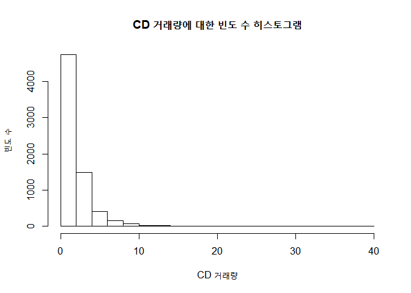

- 다섯 숫자 요약을 보면 최솟값은 1, 제1 사분위수도 1로 왼쪽 끝값에 전체 중 25% 이상이 몰려있다.
- 중간값이 2, 평균이 2.382, 제3 사분위수가 3, 최댓값이 40이다.
- 전체적으로 봉우리 하나를 가지며 오른쪽으로 꼬리가 긴 분포다.
- 언뜻 지수 분포 기본 형태의 제1 사분면과 비슷한 모양이다.

<!-- end list -->

2.  강의 길이에 대한 분포 분석

<!-- end list -->

- 문제 해결 방법: 강 길이 데이터 확인 후, 박스 플랏 출력

<!-- end list -->

```r
## data(rivers, package = "datasets")
summary(rivers)
```

    ##    Min. 1st Qu.  Median    Mean 3rd Qu.    Max.
    ##   135.0   310.0   425.0   591.2   680.0  3710.0

```r
boxplot(rivers, ylab = "강의 길이", main = "강의 길이에 대한 박스 플랏")
points(quantile(rivers)[3] + 1.5*IQR(rivers), col = "blue")
points(quantile(rivers)[3] + 2*IQR(rivers), col = "red")
```

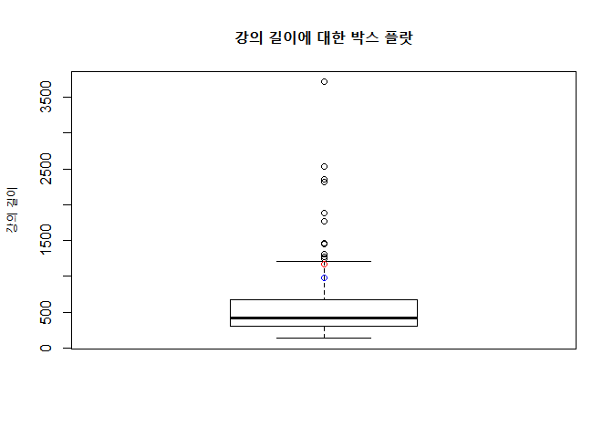

```r
sum(rivers > quantile(rivers)[3] + 2*IQR(rivers))
```

    ## [1] 13

- 일단 box plot에 끝 수염의 한계가 IF가 아니라 OF였다. lower는 최솟값으로 정해졌다.
- 분포는 데이터가 왼쪽에 몰린 오른쪽으로 꼬리가 긴 모양이다.
- outlier로 판명난 데이터는 총 13개이며 모두 큰 값쪽에 위치한다.
- 데이터의 범위가 큰 편이라 평균값에 영향을 주었을까 걱정했는데, 데이터가 작은 값에 많이 몰려서 그런지 평균은
  중심(도화지에 완전한 중심)보다 왼쪽, 작은 값에 위치해 있다.
- 중앙값은 425, 평균은 591.2로 평균이 더 크지만, 분포는 왼쪽으로의 쏠림을 강하게 주장하고 있다. 앞서 말했듯
  데이터 분산의 영향으로 보인다.

---

## 6\. Animation

> 애니메니션이란 조금씩 다른 일련의 여러 이미지를 빠르게 출력하여 사람들로 하여금 움직임과 변화에 대한 착각을 일으키게 하는
> 기법이다.

- flip book(1868, 플립 북) → phenakistoscope(1893, 페나키스토스코프) → 영화 필름

### Count down

```r
## install.packages("animation")
library(animation)
```

```r
ani.options(interval = 1)
plot.new()
for (i in 10:0) {
  rect(0, 0, 1, 1, col = "yellow")
  text_size = 11 - i
  text(0.5, 0.5, i, cex = text_size, col = rgb(0, 0, 1, 1))
  ani.pause()
}
```

- html animation making이랑 비슷하다. 아마 R 내부에서 web을 이용해 그림을 그리는 거라 그렇겠지.

> ani.options에서 interval로 설정한 시간만큼 ani.pause()로 멈춰있다가 다음으로 넘어간다.

#### 반복문의 이해

```r
sum <- 0
for (i in 1:10) sum <- sum + i
print(sum)
```

    ## [1] 55

```r
sum <- 0; i <- 1
while (i <= 10) {
  sum <- sum + i
  i <- i + 1
}; print(sum)
```

    ## [1] 55

```r
sum <- 0; i <- 1
repeat {
  sum <- sum + i
  i <- i + 1
  if (i > 10) break
}; print(sum)
```

    ## [1] 55

홀수만을 더해보자.

```r
sum <- 0
for (i in 1:10) { if (i %% 2) sum <- sum + i }
print(sum)
```

    ## [1] 25

### Random 막대 그래프

```r
while (T) {
  data <- runif(5, 0, 1)
  barplot(data, col = rainbow(5))
  ani.pause()
}
```

- 균일분포에서 5개의 값을 뽑아 매번 다른 bar plot을 그린다.

### 동전 던지기 확률의 변화 chart

```r
## plot.new()
count <- c(0, 0, 0)
for (i in 1:500) {
  coin <- sample(c(0, 1), 2, replace = T)

  index <- sum(coin) + 1
  count[index] <- count[index] + 1

  probability <- count / n
  title <- paste("반복 수:", n, "/ 500")
  barplot(probability, names.arg = c(0, 1, 2), col = rainbow(3), xlab = "앞면이 나온 횟수", ylab = "확률",
          main = title)

  Sys.sleep(0.05)
}
```

- 동전 앞, 뒤를 이해하기 더 쉽고, sum() 쓰려고 sample을 0, 1에서 뽑는 것.
- index는 이번에 나온 앞면의 갯수, count는 순서대로 앞면의 수를 축적해온 데이터셋.
- count를 상대빈도(확률)로 바꿔 bar plot을 진행한다.

### 룰렛 돌리기

```r
## install.packages("imager")
library(imager)

img.path <- "C://dump/roulette.JPG"
img <- load.image(img.path)
plot(img)
```

```r
img <- resize(img, size_x = 400L, size_y = 400L)
plot(img, xlim = c(0, 400), ylim = c(0, 400))
plot(img, xlim = c(0, 400), ylim = c(0, 400), axes = F)
```

- plot()을 이용한 출력, 더 깔끔하게 axes도 없애버렸다.

<!-- end list -->

```r
rot.count <- sample(11:20, 1)
rot.count
```

- 각도를 몇 번 줄 건지에 대한 랜덤 수

<!-- end list -->

```r
angle <- 0
for (i in 1:rot.count) {
  angle <- angle + 36
  title <- paste("룰렛 회전:", i, '/', rot.count)

  imrotate(img, angle, cx = 200, cy = 200) %>%
  draw_circle(x = 200, y = 30, radius = 30, col = c(1, 0, 0, 0), opacity = 0.5) %>%
  plot(axes = F, main = title)

  Sys.sleep(0.2)
}
```

- %\>%를 통해 새롭게 업데이트된 img를 다음 함수로 넘긴다.
- 매번 할당할 수 없기도 하고, 기호를 추가함으로써 같은 객체를 건드릴 수 있기에 사용한다.
- imrotate()에서 회전 각을 주고, drw_circle()에서 매번 같은 위치에 룰렛의 (선정) 막대를 둔다.
- 이것을 plot을 통해 출력한다.

### Lion King

```r
## install.packages("magick")
library(magick)

lion_bg <- image_read("C://dump/lion_bg.JPG")
lion1 <- image_read("C://dump/lion1.JPG")
lion2 <- image_read("C://dump/lion2.JPG")
```

#### 크기 지정

```r
lion_bg <- image_scale(lion_bg, "600x300!")
lion1 <- image_scale(lion1, "100x50!")
lion2 <- image_scale(lion2, "100x50!")
print(lion_bg, lion1, lion2)
```

#### 위치 바꾸기 연습

```r
img <- image_composite(lion_bg, lion1, offset = "+100+200")
print(img)
```

```r
moving <- 0
x <- -100; y <- 150
while (T) {
  ## if (x < 0) position <- paste(x, '+', y, sep = '')
  ## else position <- paste('+', x, '+', y, sep = '')
  position = paste('+', x, '+', y, sep = '')
  if (moving %% 2 == 0) img <- image_composite(lion_bg, lion1, offset = position)
  else img <- image_composite(lion_bg, lion12, offset = position)

  print(img)
  Sys.sleep(0.3)

  if (x > 600) break
  moving <- moving + 1
  x <- x + 20
}
```

- 초기 위치에서 x 값만 20씩 더해서 움직인다.
- 현재 그림이 0, 0을 기준으로 해서 R-studio에서 친절하게 보이지 않을 때의 움직임도 보여준다고 x가 음수일 때는
  x축 0을 기점으로 y축 반전한 것같이 해서 왼쪽으로 가게 했다.
- if의 조건은 offset가 +(-x)가 상식적이지 않아서 나눈 거 같은데 컴퓨터라서 매우 잘 읽는다.
- moving은 뛰어가는 모션을 위해 중간 중간 다른 그림을 보여주기 위함이다.

### 연습용 project

1.  수열 출력: 1 \~ 100 사이의 3의 배수 합

<!-- end list -->

- for을 통해 1:100 중 3의 배수만을 더한다.

<!-- end list -->

```r
sum = 0
for (i in 1:100) { if (i %% 3 == 0) sum = sum + i }
print(sum)
```

    ## [1] 1683

2.  당구공 굴리기

<!-- end list -->

- 당구대, 당구공 이미지 불러오기 및 크기 지정
- for를 통한 offset의 변화 주기

<!-- end list -->

```r
library(magick)
table <- image_read("C://dump/table.JPG")
ball <- image_read("C://dump/ball.JPG")

table <- image_scale(table, "300x400!")
ball <- image_scale(ball, "40x40!")
```

```r
x <- 0; y <- 0;
flagX = F; flagY = F;
while (T) {
  position <- paste('+', x, '+', y, sep = '')
  img <- image_composite(table, ball, offset = position)
  print(img)
  Sys.sleep(0.1)

  if (!flagX & x >= 260) flagX = T
  elif (flagX & x <= 40) flagX = F
  if (!flagY & y >= 360) flagY = T
  elif (flagY & y <= 40) flagY = F

  if (flagX) x = x - 10
  else x = x + 10
  if (flagY) y = y - 10
  else y = y + 10
}
```

- 사실 R(인지 studio인지)의 친절함을 생각했을 때 table을 바탕으로 깔고 하면, 실제 위치는 이상할지라도 그림은
  마치 튕겨나오는 것처럼 보이게 할 수 있다.
