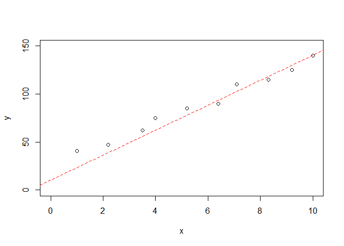
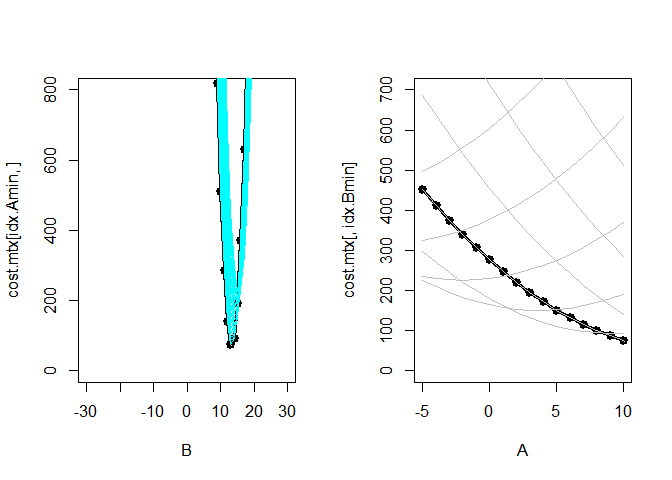
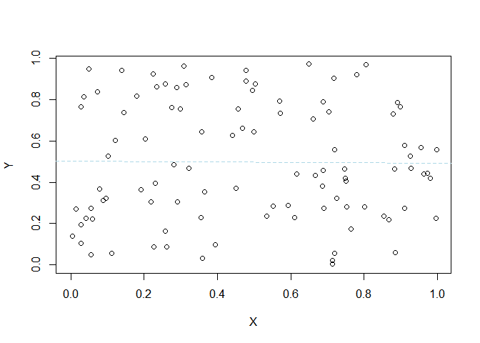

빅데이터 분석의 첫걸음 R코딩
================

  - Author: 장용식, 최진호
  - Book: <https://book.naver.com/bookdb/book_detail.nhn?bid=16324211>
  - coding은 example들을 제외하고는 programming으로 넘겼습니다.

-----

## 12\. 시뮬레이션

> 시뮬레이션이란 시간에 따라 시스템 또는 실세계의 과정이 변하는 것을 모방하는 것을 의미한다.

|                simulation                 | description                                                   |
| :---------------------------------------: | ------------------------------------------------------------- |
|         아날로그 (analog simulation)          | 시스템을 모방하여 만든 실제 모형을 이용해 현상을 파악하는 것이다.                         |
|         디지털 (degital simulation)          | 컴퓨터를 이용해서 수치적으로 분석하는 것이다.                                     |
| 몬테카를로 시뮬레이션<br />(Monte-Carlo Simulation) | 디지털 시뮬레이션 중 하나, 확률 변수를 표현하기 위해 난수 (random number)를 이용하는 시뮬레이션 |
|                                           |                                                               |
|                   확정모형                    | 확률을 표현하는 변수들의 관계가 확실하여 예측치를 계산할 수 있는 모형                       |
|                   확률모형                    | 결과를 정확하게 예측할 수 없는 모형                                          |

  - 대수의 법칙 (Law of large numbers): 실험 횟수가 많아지면 경험적 확률이 수학적 확률과 같아지는 현상

### 표본추출

|  표본추출  |                                  |
| :----: | -------------------------------- |
| 복원 추출  | 앞선 경우를 고려하지 않고, 매번 독립적인 확률을 가진다. |
| 비복원 추출 | 앞서 뽑힌 경우를 제외하고, 새롭게 확률을 구성한다.    |

``` r
sample(c("앞면", "뒷면"), 10, replace = T)
```

    ##  [1] "앞면" "앞면" "뒷면" "뒷면" "앞면" "뒷면" "앞면" "앞면" "앞면" "앞면"

### 난수

*무작위로 만들어진 수열*

``` r
runif(10, min = 0, max = 1)
```

    ##  [1] 0.15371964 0.83767036 0.15306347 0.77141913 0.60100889 0.27199606
    ##  [7] 0.05014485 0.12501813 0.54852915 0.66890522

동전 던지기: 우리 이거 했던 거 같으니까 얜 돌리지 말아야지

``` r
iteration <- 5000
plot(0, 0, xlab = "동전을 던진 횟수", ylab = "앞면이 나오는 비율", xlim = c(0, iteration), ylim = c(0,1))
abline(a = 0.5, b = 0, col = "red")

sum <- 0
for (x in 1:iteration) {
  coin <- sample(c("앞면", "뒷면"), 1)
  if (coin == "앞면") sum = sum + 1
  prob <- sum / x
  points(x, prob)
}
```

``` r
iteration <- 5000
x <- sample(c(0,1), iteration, replace = T)
round(sum(x)/iteration * 100, 1)
```

    ## [1] 49.5

정사각형 내 들어가는 쿼터 원(부채꼴)을 이용한 원주율 구하기

``` r
iteration <- 1000
n_circle <- 0
for (i in 1:iteration) {
  X <- runif(1, 0, 1)
  Y <- runif(1, 0, 1)
  dist <- sqrt(X^2 + Y^2)
  if (dist <= 1) n_circle <- n_circle + 1
}; rm(i)

pi <- 4*n_circle/iteration
pi
```

    ## [1] 3.192

회귀선 구하기

``` r
x <- c(1, 2.2, 3.5, 4, 5.2, 6.4, 7.1, 8.3, 9.2, 10)
y <- c(41, 47, 62, 75, 85, 90, 110, 115, 125, 140)
plot(x, y, xlim = c(0,10), ylim = c(0,150))
```


``` r
A <- -5:10; B <- -30:30
cost.mtx <- matrix(NA, nrow = length(A), ncol = length(B))

for (i in 1:length(A)) {
  for (j in 1:length(B)) {
    err.sum <- 0
    for (k in 1:length(x)) {
      y_hat <- B[j]*x[k] + A[i]
      err <- (y_hat - y[k])^2
      err.sum <- err.sum + err
    }
    cost <- err.sum/length(x)
    cost.mtx[i, j] <- cost
  }
}
cost.mtx[1:5, 1:5]
```

    ##         [,1]     [,2]     [,3]     [,4]     [,5]
    ## [1,] 83877.5 80232.04 76667.79 73184.75 69782.91
    ## [2,] 83349.1 79715.02 76162.15 72690.49 69300.03
    ## [3,] 82822.7 79200.00 75658.51 72198.23 68819.15
    ## [4,] 82298.3 78686.98 75156.87 71707.97 68340.27
    ## [5,] 81775.9 78175.96 74657.23 71219.71 67863.39

``` r
range(cost.mtx)
```

    ## [1]    75.967 83877.500

``` r
idx <- which(cost.mtx == min(cost.mtx), arr.ind = T)
idx
```

    ##      row col
    ## [1,]  16  44

``` r
idx.Amin <- idx[1, 1]
idx.Bmin <- idx[1, 2]
Amin <- A[idx.Amin]
Amin
```

    ## [1] 10

``` r
Bmin <- B[idx.Bmin]
Bmin
```

    ## [1] 13

``` r
plot(x, y, xlim = c(0,10), ylim = c(0,150))
abline(a = Amin, b = Bmin, lty = 2, col = "red")
```



가능한 범위에서 비용함수 그래프 그리기

``` r
par(mfrow = c(1,2))
plot(B, cost.mtx[idx.Amin,], ylim = c(0,800), type = 'o', lwd = 3)
for (i in 1:length(A)) {
  lines(B, cost.mtx[i,], col = j)
  Sys.sleep(0.5)
}

plot(A, cost.mtx[,idx.Bmin], ylim = c(0,700), type = 'o', lwd = 3)
for (j in 1:length(B)) {
  lines(A, cost.mtx[, j], col = i)
  Sys.sleep(0.5)
}
```



``` r
## install.packages("rgl")
library(rgl)
```

``` r
persp3d(B, A, cost.mtx, col = "yellow")
persp3d(B, A, cost.mtx, col = "yellow", zlim = c(0,400))
```

-----

### 연습용 project

1.  주사위 던지기

<!-- end list -->

  - 주사위를 던지는 횟수는 100, 1000, 10000으로 늘어나게 할 수 있지만, 굳이 늘어날 필요는 없다.
  - 같은 눈이 나올 수학적 확률은 6/36이다.

<!-- end list -->

``` r
sum <- 0; iteration <- 1000
for (i in 1:iteration) {
  dice <- sample(1:6, 2, replace = T)
  if (dice[1] == dice[2]) sum <- sum + 1
}
sum/iteration
```

    ## [1] 0.154

  - 귀찮으니까 1000번만 하자.

<!-- end list -->

2.  시뮬레이션과 통계적 방법의 회귀선 비교

<!-- end list -->

  - 기울기는 \[0.5, 1.5\], y절편은 \[2, 3\]에 간격은 0.001로 소수점 셋째자리까지
  - 12.4에서 난수로 발생시킨 데이터로 하래.

<!-- end list -->

``` r
X <- runif(100, 0, 1)
Y <- runif(100, 0, 1)
```

``` r
W <- seq(0.5, 1.5, 0.001); B <- seq(2, 3, 0.001)
cost.mtx <- matrix(NA, nrow = length(W), ncol = length(B))

for (i in 1:length(W)) {
  for (j in 1:length(B)) {
    err.sum <- 0
    for (k in 1:length(X)) {
      y_hat <- W[i]*X[k] + B[j]
      err <- (y_hat - Y[k])^2
      err.sum <- err.sum + err
    }
    cost <- err.sum/length(X)
    cost.mtx[i, j] <- cost
  }
}
```

``` r
range(cost.mtx)
```

    ## [1]  3.143887 10.703089

``` r
idx <- which(cost.mtx == min(cost.mtx), arr.ind = T)
idx.Wmin <- idx[1, 1]
idx.Bmin <- idx[1, 2]
Wmin <- W[idx.Wmin]
Bmin <- B[idx.Bmin]
```

``` r
regression = lm(Y ~ X)
plot(X, Y, xlim = c(0, max(X)), ylim = c(0, max(Y)))
abline(a = Bmin, b = Wmin, lty = 2, col = "seagreen")
abline(a = regression$coefficients[1], lty = 2, col = "lightblue",
       b = ifelse(is.na(regression$coefficients[2]), 0, regression$coefficients[2]))
```


