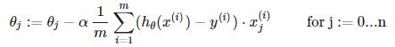
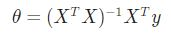

> # Machine Learning

- Instructor: Andrew Ng
- Lectures: [Coursera](https://www.coursera.org/learn/machine-learning?action=enroll)
- [Sub-link](https://www.coursera.org/lecture/machine-learning/model-representation-db3jS?utm_source=link&utm_medium=in_course_lecture&utm_content=page_share&utm_campaign=overlay_button)

---

## Multiple Features Regression

_Multivariate linear Regression_

> hθ(x) = θ'x

| notaion | description                                        |
| ------- | -------------------------------------------------- |
| m, n    | use m for sample size and n for number of features |
| x^i     | input features vector of ith training, \|R^(n+1)   |
| x^i_j   | value of feature j in ith training                 |

- hθ(x) = θ0 + θ1x1 + θ2x2 + θ3x3 + ... + θnxn<br />
  hθ(x) = θ0x0 + θ1x1 + θ2x2 + θ3x3 + ... + θnxn (when x0 = 1 for (i ∈ 1, ... , m))

- 이래서 테이블 데이터에 대해서 row 인덱스로 i를, column 인덱스로 j를 사용한다.
- 모델 수식 표기상 x_ij로 표기하지만, 역할에 따라 다시 표기하면 x_ji가 된다.

### Features and polynomial regression

> can combine multiple features into one

- 데이터 분포에 따라 분석가의 재량으로 모델은 제곱근 함수, n차 함수가 될 수 있다.
- one important thing to keep in mind is, if you choose your features this multiple using then feature scaling becomes very important.
- 같은 변수라 mean normalization보다 scaling에 더 주력한다.

### Gradient Descent for Multivariate

```
simultaneosly update
```



- 범위가 넓은 feature가 있다면, cost contour는 그쪽으로 길어진 타원이 형성된다.
- 여러 개의 feature의 단위크기를 비슷하게 맞출 수 있다면, j-function에 대한 contour는 원에 가까워질 것이고, 원에 가까울수록 최솟점을 찾는데 걸리는 시간이 줄어든다.

| method             |                                    |
| ------------------ | ---------------------------------- |
| feature scaling    | 편차, 데이터 범위를 줄이는 것이다. |
| mean normalization | 평균을 대략 0으로 맞추는 것이다.   |

- 대체로 [-0.5, 0.5]으로 줄일 수 있다.
- 기본적으로 standardization을 사용하며 편차를 모를 때는 range로 나눠준다.
- 해당 기법은 gradient descent에서 최솟점을 빠르게 찾기 위한 방법이므로 나누는 값이 규격화된 값일 필요는 없다.

```
Learning Rate (α)
```

- if is healthy, j(θ) slowly decrease after every iteration.
- 반복하면서 업데이트된 j-function의 값을 그래프로 표현해 수렴하는 점을 찾는다.
- 그래프에 찍어가며 찾기는 힘드니까 임계점(변환 최소점) hyper parameter를 정해 automatic convergence test algorithm을 사용하기도 한다.

| Learning Rate (α) | cost function will                               |
| ----------------- | ------------------------------------------------ |
| α is so high      | be increasing or repeat decresing and increasing |
| α is so low       | slowly decreasing                                |

- Andrew Ng께선 적절한 α를 찾기 위해 0.001, 0.01, 0.1, 1을 모두 시도해보고 필요에 따라 다 n을 곱해서 해보고, 가능한 큰 값에서 작지만 큰 값을 이용하는 식으로 적절한 값을 찾으신다고 한다.

### Normal Equation

> multivariate의 최소제곱법에서 n+1개의 편미분 방정식에서 극솟값을 찾는 과정의 이름.



- feature scaling을 필요로 하지 않는다.

| non-invertible?            |                                                        |
| -------------------------- | ------------------------------------------------------ |
| Redundant features         | features are very closely related (linearly dependent) |
| Too many features (m <= n) | delete some features, or use regularization            |

- 중복되거나 필요없는 변수 줄이기를 우선으로 하되, 그럼에도 역행렬이 없다면, 계산하는데 문제가 생긴다면, 변수 갯수를 더 줄이거나 regularization을 고려한다.

---

| Gradient Descent                | Normal Equation                                             |
| ------------------------------- | ----------------------------------------------------------- |
| need to choose α                | No need to choose α                                         |
| needs many iterations           | No need to iterate                                          |
|                                 |                                                             |
| O(kn^2)                         | O(n^3), need to compute hat-matrix                          |
| Works well even when n is large | slow if n is very large                                     |
|                                 | 특정 모델에 대해선 n의 갯수와 별개로 최소제곱법이 최고라고. |

- 역행렬을 계산하는데 feature 갯수의 세제곱만큼 걸리니 O(n^3)으로 표현할 수 있고 n이 크다면 상당히 오래 걸리게 된다.
- 2010년대로 기억하는데, 그때도 10^4 쯤 돼야 gradient descent를 할 생각이셨다니 역시 automatic이 짱이다.
