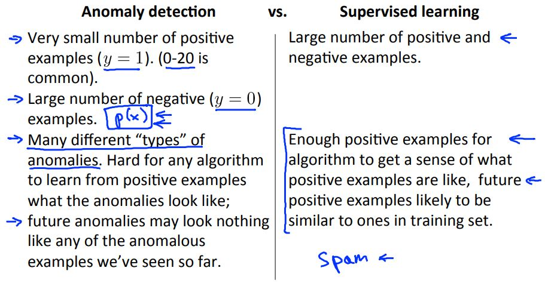
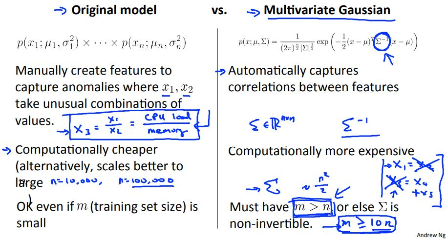

> # Machine Learning

- Instructor: Andrew Ng
- Lectures: [Coursera](https://www.coursera.org/learn/machine-learning?action=enroll)
- [Sub-link](https://www.coursera.org/lecture/machine-learning/model-representation-db3jS?utm_source=link&utm_medium=in_course_lecture&utm_content=page_share&utm_campaign=overlay_button)

---

<!-- 9th, 예제가 많은 주구만. -->

지도 학습을 바탕으로 한 이상 감지 시스템

- 여러 독립 변수의 값으로 로지스틱 모형을 구성한다.
- 최대한 이상이 없어야 하므로, threshold보다 클 때만 정상으로 판단한다.
- 또, modeling이 잘 되었다면 속성이 적을수록 임계값은 작아진다.

 

- 확률 <i>p(X; mu, sigma)</i>이 다변량(각각 독립)일 때의 확률(곱과 그때의) 계산값에 대해 설명하셨다.
- 각각의 독립변수의 분포(simple-Normal)로 P를 구성하는 것은 모든 독립변수가 이루는 분포의 일부밖에 설명하지 못한다. 이로 인해 각각의 분포가 아닌 통합된 하나의 분포(Gaussian)로 P를 구한다.
- 독립변수의 분포가 다변량 정규분포, Gaussian을 이루지 못하면, 모델 추정의 신뢰값이 작아질 수 있다. <!-- 이는 통계학에서 배우는 모델 가정과 모델 추정에 대한 개념과 연결된다. -->

<!-- Anomaly Detection vs. Supervised Learning -->

<!-- The original model can be more computationally efficient than the multivariate Gaussian model, and thus might scale better to very large values of n (number of features). -->

 

- 기본적으로 이상 감지 시스템은 비지도 학습이어야 한다.
- 처음부터 이상 데이터를 가질 수 없기 때문이고, 이로 인해 우리가 아는 수준을 벗어나면 이상으로 판단한다. 이 때문에 적은 양의 positive 데이터로 모델을 구성해(모수를 추정해) 사용한다.

<!-- Original model vs. Multivariate Gaussian -->

<!-- You run a power utility (supplying electricity to customers) and want to monitor your electric plants to see if any one of them might be behaving strangely. -->
<!-- A computer vision / security application, where you examine video images to see if anyone in your company's parking lot is acting in an unusual way. -->

---

점검

- 이 시스템을 점검할 때는 지도 학습 데이터를 이용해 오류율을 계산하는 형식이 된다.
점검할 때는 귀무가설의 우선 사항처럼 임계값과 같거나 클 때를 0(정상)으로 판단하시는 듯하다.

Content-based 
