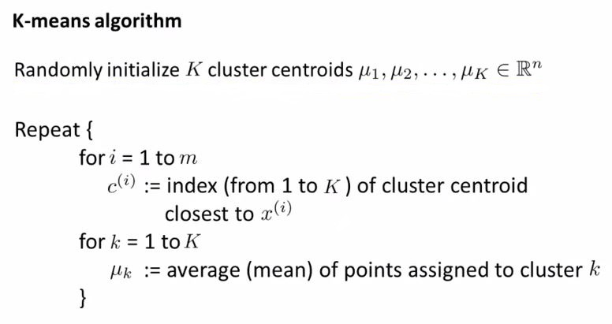

> # Machine Learning

- Instructor: Andrew Ng
- Lectures: [Coursera](https://www.coursera.org/learn/machine-learning?action=enroll)
- [Sub-link](https://www.coursera.org/lecture/machine-learning/model-representation-db3jS?utm_source=link&utm_medium=in_course_lecture&utm_content=page_share&utm_campaign=overlay_button)

---

## Unsupervised Learning

- unlabeled dataset, find structures
- Market segmentation, Social network analysis, Organize computing clusters, Astronomical data analysis

### K-means Clustering

: 임의로 data를 잡아 임의의 class(cluster)를 부여한다. 다른 모든 점들을 가까운 cluster의 값으로 가정하고, 이 값들의 평균으로 cluster point를 옮긴다. 이를 더이상 변화가 없을 때까지 반복한다.

- label이 없기에 더욱 초기값에 의존하며, logical optimum에 쉽게 안주한다. → 반복으로 해결.
- model에 bias가 없기 때문에, <i>x0</i>은 없다.
- data가 하나도 할당되지 못한 cluster는 일반적으로 제거한다.

#### find proper k-value

- 효율성을 위해 10보다 작은 k를 선택한다.
- 적절한 k를 찾는 것은 Cost를 이용한 (ROC) elbow point를 이용하나 만능은 아니다.
- 당연히 k가 늘어날수록 Cost는 줄어든다. (because of Overfitting)
- 결과적으로 k는 clustering이 아닌 외부 조건(필요)에 의해 결정된다.

#### Cost

- 모든 data에 부여된 cluster와 해당 평균값(<i>mui</i>)까지의 거리의 평균
- sometimes called the distortion cost function
- <i>c(i)</i>의 적절한 위치를 찾지 못했다고 해서 local optimum을 찾을 때까지의 cost가 커지거나 하는 일은 없다.
