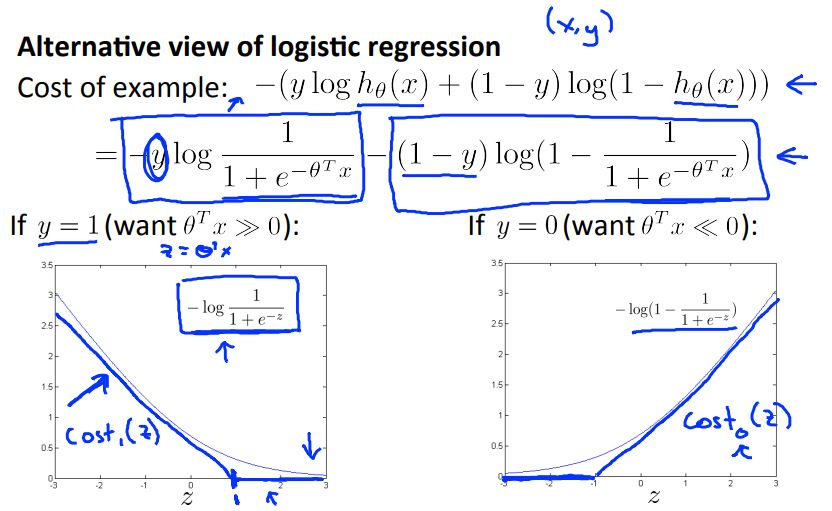
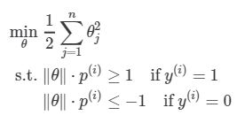
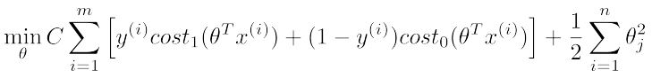
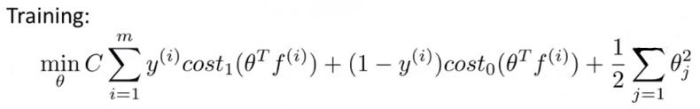
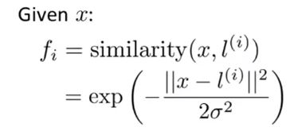
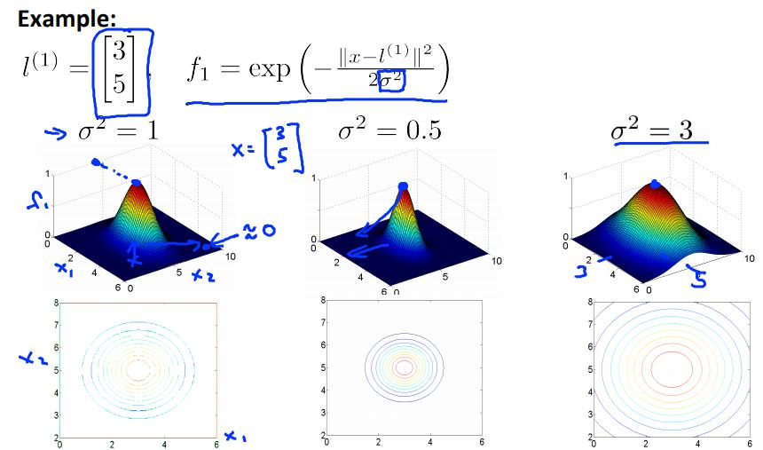

> # Machine Learning

- Instructor: Andrew Ng
- Lectures: [Coursera](https://www.coursera.org/learn/machine-learning?action=enroll)
- [Sub-link](https://www.coursera.org/lecture/machine-learning/model-representation-db3jS?utm_source=link&utm_medium=in_course_lecture&utm_content=page_share&utm_campaign=overlay_button)

---

### SVM: Support Vector Machine

- diagnostic의 일종이라고?
- SVM이 계수의 합에 대한 가중치를 조정하는 거였어?
- 기초 개념은 Relu의 등장과 비슷하다. 불필요하게 작은 값들을 0으로 만들어버린다. 이를 이용해 hyper-plane을 만드는 것으로 보인다.

<table>
  <tr>
    <td colspan="2"></td>
  </tr>
  <tr>
    <td></td>
    <td></td>
</table>

경계선과 수직인 theta에 투영되는 data들의 값(내적, <i>p(i)</i>)의 절댓값이 작으면 작을수록 이를 보완하고자 theta의 벡터값은 큰 값을 가지게 된다. 이때 모든 data로부터 형성되는 내적 벡터를 선형으로 연결한 것이 SVM의 margin이 된다.

|        techinique         | description                                                          |
| :-----------------------: | -------------------------------------------------------------------- |
|  Large margin classifier  | classifier의 경계선을 최대화하는 기술                                |
| Support Vector classifier | (almost perfect) separate classifier (2-plane)                       |
|  Support Vector Machine   | classifier의 정밀도와 기타 여러 조건들을 최적화하는 hyper-plane 기술 |

### Kernel

- kernel function is alike similarity function
- no kernel ("linear kernel"): predict "y = 1" if h(x) >= 0
- Gaussian kernel: 각 계수가 지닌 변수가 가까운 data일수록 변수값을 크게 ([0, 1]) 주는 (유사도) 함수
  
  |    parameters     | description                                                              |
  | :---------------: | ------------------------------------------------------------------------ |
  |   C (1/lambda)    | large: small lambda, high variance small: large lambda, high bias   |
  | sigma2 | large: more smoothly, high bias small: less smoothly, high variance |
  

 

- other choices of kernel
  Not all similarity functions aimilarity(x, l) make valid kernels. (Need to satisfy technical condition called "Mercer's Theorem" to make sure SVM packages' optimizations run correctly, and do not diverge.)
- Polynomial kernel: <i>k(x, l) = (X'l + constant)degree</i>
- More esoteric: String kernel, chi-square kernel, histogram intersection kernel, ...

---

- 당연하게도 multi-class classification은 one-vs-all을 다중으로 사용하는 것이 기초 개념이 된다.

- logistic vs SVM
  n = number of features, m = number of training examples
  if n is large (relative to m): use logistic regression, or svm without a kernel
  if n is small, m is intermediate: use svm with gaussian kernel
  if n is small, m is large: create/add more features, then use logistic regression or svm without a kernel
  Neural network likely to work well for most of these settings, but may be slower to train.
