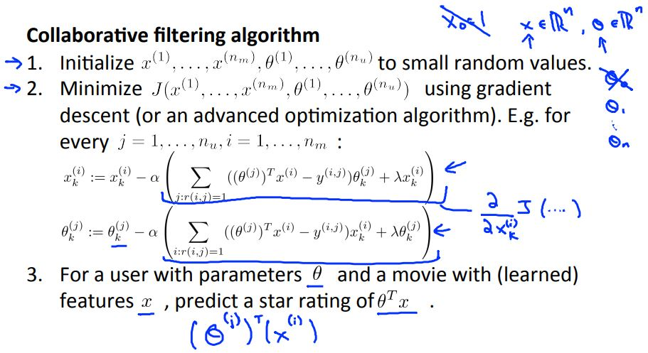

> # Machine Learning

- Instructor: Andrew Ng
- Lectures: [Coursera](https://www.coursera.org/learn/machine-learning?action=enroll)
- [Sub-link](https://www.coursera.org/lecture/machine-learning/model-representation-db3jS?utm_source=link&utm_medium=in_course_lecture&utm_content=page_share&utm_campaign=overlay_button)

---

#### spam separate

Given a data set of emails, we could construct a vector for each email. Each entry in this vector represents a word. The vector normally contains 10,000 to 50,000 entries gathered by finding the most frequently used words in our data set. If a word is to be found in the email, we would assign its respective entry a 1, else if it is not found, that entry would be a 0. Once we have all our x vectors ready, we train our algorithm and finally, we could use it to classify if an email is a spam or not.

So how could you spend your time to improve the accuracy of this classifier?

- Collect lots of data (for example "honeypot" project but doesn't always work)
- Develop sophisticated features (for example: using email header data in spam emails)
- Develop algorithms to process your input in different ways (recognizing misspellings in spam).

It is difficult to tell which of the options will be most helpful.

---

#### data for machine learning

- perceptron (logistic regression), winnow, memory-based, naive bayes

> it's not who has the best algorithm that wins. It's who has the most data.

large data set을 갖는 건 이상적일 때는 매우 좋은 결과를 내겠지만, 반응변수를 충분히 설명하지 못하는 data set일 때는 많아봤자 모델을 어렵게 구성해봤자 소용이 없다.

따라서, 데이터를 수집할 때는 관념적으로 반응변수에 영향을 주는 변수들을 포함해 (제대로) 수집할 수 있도록 해야 한다.

---

### Recommender Systems

- Content Based Recommendations
- 다중 회귀처럼 표현되는데, 가변수를 이용해 그 중 일부 변수에 집중

 

- 사람들의 분류에 대한 선호도와 영화의 별점으로 해당 영화가 어떤 분류에 속하는지 알 수 있다.
- 반대로 특정 영화의 분류와 어떤 사람의 분류에 대한 선호도를 안다면 그 사람의 별점을 예측할 수 있다.

결과적으로 예측하고자 하는 y를 위해 적절한 x를 찾아야 함에 이르게 된다.

- Choosing small random value serves as symmetry breaking (similar to the random initialization of a neural network's parameters) and ensures the algorithm learns features X that are different from each other.
- 이를 바탕으로 유사도(거리) 측정을 통해 유사한 영화를 찾고 추천할 수 있다.

 

- 당연하게도 측정된 별점이 없는 사람에게는 결측값 대체를 통해 별점 행렬에 결측값을 없애고 알고리즘을 진행한다. (평균 별점 이용: Mean Normalization)
