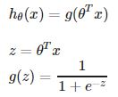
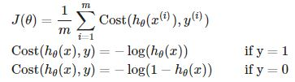
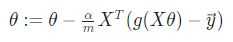

> # Machine Learning

- Professor: Andrew Ng
- Lectures: [Coursera](https://www.coursera.org/learn/machine-learning?action=enroll), [Sub-link](https://www.coursera.org/lecture/machine-learning/model-representation-db3jS?utm_source=link&utm_medium=in_course_lecture&utm_content=page_share&utm_campaign=overlay_button)

<br /><br /><br />

---

## Multiple Features Regression

*Multivariate linear Regression*

> h<sub>θ</sub>(x) = θ'x

| notaion                   | description                                              |
| ------------------------- | -------------------------------------------------------- |
| m, n                      | use m for sample size and n for number of features       |
| x<sup>i</sup>             | input features vector of ith training, \|R<sup>n+1</sup> |
| x<sup>i</sup><sub>j</sub> | value of feature j in ith training                       |

- h<sub>θ</sub>(x) = θ<sub>0</sub> + θ<sub>1</sub>x<sub>1</sub> + θ<sub>2</sub>x<sub>2</sub> + θ<sub>3</sub>x<sub>3</sub> + ... + θ<sub>n</sub>x<sub>n</sub><br />
  h<sub>θ</sub>(x) = θ<sub>0</sub>x<sub>0</sub> + θ<sub>1</sub>x<sub>1</sub> + θ<sub>2</sub>x<sub>2</sub> + θ<sub>3</sub>x<sub>3</sub> + ... + θ<sub>n</sub>x<sub>n</sub>, &nbsp; when x<sub>0</sub> = 1 for (i ∈ 1, ... , m)

- 이래서 테이블 데이터에 대해서 row 인덱스로 i를, column 인덱스로 j를 사용한다.
- 모델 수식 표기상 x<sub>ij</sub>

<br />

<hr style="border-style: dotted; opacity: 0.5;" />

### Features and polynomial regression

> can combine multiple features into one

- 데이터 분포, 분석가의 재량에 따라 모델은 제곱근 함수, n차 함수가 될 수 있다.
- one important thing to keep in mind is, if you choose your features this multiple using then feature scaling becomes very important.
- 같은 변수라 mean normalization보다 scaling에 더 주력한다.

<br />

| Gradient Descent                | Normal Equation                                             |
| ------------------------------- | ----------------------------------------------------------- |
| need to choose α                | No need to choose α                                         |
| needs many iterations           | No need to iterate                                          |
|                                 |                                                             |
| O(kn<sup>2</sup>)               | O(n<sup>3</sup>), need to compute hat-matrix                |
| Works well even when n is large | slow if n is very large                                     |
|                                 | 특정 모델에 대해선 n의 갯수와 별개로 최소제곱법이 최고라고. |

- 역행렬을 계산하는데 feature 갯수의 세제곱만큼 걸리니 O(n<sup>3</sup>)이고 n이 크다면 상당히 오래 걸리게 된다.
- 2010년대로 기억하는데, 그때도 10<sup>4</sup> 쯤 돼야 gradient descent를 할 생각이셨다니 역시 automatic이 짱이다.

### 1. Gradient Descent for Multivariate

```
simultaneosly update
```


- 범위가 넓은 feature가 있다면, cost contour는 그쪽으로 길어진 타원이 형성된다.
- 여러 개의 feature의 단위크기를 비슷하게 맞출 수 있다면, j-function에 대한 contour는 원에 가까워질 것이고, 원에 가까울수록 최솟점을 찾는데 걸리는 시간이 줄어든다.

| method             |                                    |
| ------------------ | ---------------------------------- |
| feature scaling    | 편차, 데이터 범위를 줄이는 것이다. |
| mean normalization | 평균을 대략 0으로 맞추는 것이다.   |

- 대체로 [-0.5, 0.5]으로 줄일 수 있다.
- 기본적으로 standardization을 사용하며 편차를 모를 때는 range로 나눠준다.
- 해당 기법은 gradient descent에서 최솟점을 빠르게 찾기 위한 방법이므로 나누는 값이 규격화된 값일 필요는 없다.

```
Learning Rate (α)
```

- if is healthy, j(θ) slowly decrease after every iteration.
- 반복하면서 업데이트된 j-function의 값을 그래프로 표현해 수렴하는 점을 찾는다.
- 그래프에 찍어가며 찾기는 힘드니까 임계점(변환 최소점) hyper parameter를 정해 automatic convergence test algorithm을 사용하기도 한다.

| Learning Rate (α) | cost function will                               |
| ----------------- | ------------------------------------------------ |
| α is so high      | be increasing or repeat decresing and increasing |
| α is so low       | slowly decreasing                                |

- Andrew Ng께선 적절한 α를 찾기 위해 0.001, 0.01, 0.1, 1을 모두 시도해보고 필요에 따라 다 n을 곱해서 해보고, 가능한 큰 값에서 작지만 큰 값을 이용하는 식으로 적절한 값을 찾으신다고 한다.

### 2. Normal Equation

> multivariate의 최소제곱법에서 n+1개의 편미분 방정식에서 극솟값을 찾는 과정의 이름.


- feature scaling을 필요로 하지 않는다.

| non-invertible?            |                                                        |
| -------------------------- | ------------------------------------------------------ |
| Redundant features         | features are very closely related (linearly dependent) |
| Too many features (m <= n) | delete some features, or use regularization            |

- 중복되거나 필요없는 변수 줄이기를 우선으로 하되, 그럼에도 역행렬이 없다면, 계산하는데 문제가 생긴다면, 변수 갯수를 더 줄이거나 regularization을 고려한다.

---

## Classification, _discrete valued response_

### 1. Binary (class) classification

_단일 분류, 반응변수가 베르누이(0 or 1)를 따르는 경우_

```
y ∈ {0, 1} - 0: Negative Class
            \ 1: Positive Class
```

- 관심사가 악성 종양인지 아닌지를 판단하는 것이라면, positive를 악성 종양으로 negative를 그렇지 않은 일반 종양으로 분류할 수 있다.

#### 1. linear regression model

| concept               | description                                         |
| --------------------- | --------------------------------------------------- |
| threshold             | minimum (percent) value that decides to 1 on simple |
| **Decision Boundary** | line like separate class due to multivariate input  |

- 선형식이 무릇 그렇듯 (비표본 오류로 인한) 데이터 오염과 극값의 영향을 잘 받는다.
- response =/= [0, 1]



- g-function is a Sigmoid function (or Logistic function)
- logit을 이용해 response를 [0, 1]로 제한한다.

```
hθ(x) = Pr(y = 1|x; θ) = 1 - Pr(y = 0|x; θ)
probability that y = 1, given x, parameterized by θ
```

```
predict "y = 1", if hθ(x) ≥ threshold, when z ≥ value_of_z_range
predict "y = 0", if hθ(x) < threshold, when z < value_of_z_range

z = 0, e^0 = 1 → g(z) = 0.5

θ'x ≥ 0, y = 1
```

- h<sub>θ</sub>(x), g(z), θ'x로 다양하게 response 범위를 나타낼 수 있다.
- 어떻게 설정하냐에 따라 parameter의 부호가 달라지지만, 기본은 변하지 않는다.
- for decision boundary, set region each class

#### 2. Logistic regression model

- response의 범위 제한을 위해 모델로부터 나온 값을 변형하는 것에서 한 단계 나아가 모델에 변형식을 넣는다.
- 복잡한 sigmoid나 logit을 MSE에 넣게 되면, (극솟값이 하나가 아니라서) non-convex (비볼록 함수)가 나온다.
- 이러면 기울기 하강법을 사용할 수 없어 최대가능도추정법(MLE, Maximum Likelihood Estimation)를 이용한 새로운 Cost function을 사용한다.
- 미분을 하면 제곱이 1/2를 가져갈 거라 cost로 묶어버렸다.



```
Cost(hθ(x), y) = 0, if hθ(x) = y
Cost(hθ(x), y) → ∞, if y = 0 and hθ(x) → 1
Cost(hθ(x), y) → ∞, if y = 1 and hθ(x) → 0
```

- MLE: Cost(h<sub>θ</sub>(x), y) = - y\*ln(h<sub>θ</sub>(x)) - (1 - y)\*ln(1 - h<sub>θ</sub>(x))



- 여전히 gradient descent을 최소의 cost 값을 찾는 최적화 알고리즘으로 사용한다.
- 선형 회귀의 기울기 하강법을 진행할 때와 식이 같다.
- Octave에선 fminunc라는 함수를 통해 상황에 따라 더 나은 최적화 알고리즘을 사용해 optimized parameter를 구한다.

<table>
  <tr>
    <td colspan="3">Other optimization algorithm</td>
    <td>than gradient descent</td>
  </tr>
  <tr>
    <td rowspan="3">Conjugate gradient</td>
    <td rowspan="3">BFGS</td>
    <td rowspan="3">L-BFGS</td>
    <td>No need to manually pick α</td>
  </tr>
  <tr>
    <td>Often faster than gradient descent.</td>
  </tr>
  <tr>
    <td>More complex</td>
  </tr>
</table>

### 2. Multiclass classification

_다중 분류, 여러 개의 binary classification으로 나누는 게 알고리즘의 핵심_

1. One-vs-all (one-vs-rest)

<!--
> Train a logistic regression classifier hθ<sup>i</sup>(x) for each class to predict the probability that y = i<br />
> On a new input x, to make prediction, pick the claa i that maximizes
-->

```
hθ^i(x) = Pr(y = i|x; θ), i = 1,2,3
```

- 모든 class에 대해 해당 class와 나머지의 binary 분류로 만들어 학습시킨다.
- 당연하게도 class의 갯수만큼 binary classifier가 나온다.
- 새로운 데이터에 대해서 가장 가능성, h<sub>θ</sub><sup>i</sup>(x)이 높은 class로 분류한다.
