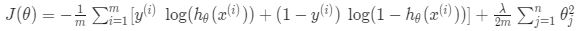
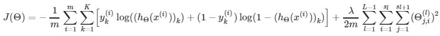
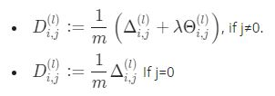
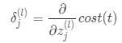
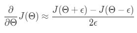

i> # Machine Learning

- Instructor: Andrew Ng
- Lectures: [Coursera](https://www.coursera.org/learn/machine-learning?action=enroll)
- [Sub-link](https://www.coursera.org/lecture/machine-learning/model-representation-db3jS?utm_source=link&utm_medium=in_course_lecture&utm_content=page_share&utm_campaign=overlay_button)

---

### Non-linear Hypothesis

- one-vs-all로 다량의 logistic을 합치거나 다차항회귀를 sigmoid function으로 변환시켜야 한다.
- feature가 많아지면, 이에 따라 다차항은 <i>O(N2)</i>으로 증가하며, n개의 features가 p차 polynomial를 승법적으로 구성한다면 <i>O(Np)</i>개의 항이 된다. 정확하게 표현하자면, <i>O(n p/2)</i>
- Computer Vision에서 모든 화소는 features로 포함되어야 한다.
- 원래라면 feature는 열로 구분되어야 하지만, neural network에선 programming과의 연관을 생각해 feature가 행으로 구분된다. 이에 유의할 것.

## Neural Network

- 신경세포의 가장 큰 특징은 세포체, 수많은 가지돌기(dendrites), (랑비에 결절이 있는 긴 가지 끝에) 수많은 축삭돌기(axons)다. 이들은 spikes라는 전기 신호를 주고 받는다.

> input layer → activation function → hidden layer → activation function → output layer <i>x → (θ(1)) → activation → a(2) → (θ(2)) → activation→ a(3) → ... → (θ( j)) → (activation) → y</i>

- 모든 layer에 bias unit은 1로서 존재하지만, 가독성을 위해 생략한다.
- activation function을 sigmoid로 고정하면서 output layer에 binary한 값을 주는 무슨 박스는 생략해버렸다. 따라서, 독립된 layer를 갖진 않는 것 같다.

|               concept                | description                                                                    |
| :----------------------------------: | ------------------------------------------------------------------------------ |
|                  L                   | total number of layers in the network                                          |
|         <i>θ( j )         | matrix of weights controlling function mapping from layer j to layer j + 1</i> |
| <i>ai( j )</i> | "activation" of unit i in layer j                                              |
|         <i>sl</i>         | number of units (not counting bias unit) in layer <i>l</i>                     |
|                  K                   | number of output units/classes                                                 |

> If network has <i>sj</i> units in layer <i>j</i> and <i>sj+1</i> units in layer <i>j+1</i>, then <i>θ( j )</i> will be of dimension <i>sj+1</i> X <i>(sj + 1)</i>

- input을 일정한 비율로 더해서 activation function을 통한 재표현을 거친 후 다음 layer의 input으로 보낸다.
- AND, OR, XOR은 input과 output의 관계를 한 번에 설명하는 몇 가지 연산자이다.
- 이산수학의 비트 연산 모두를 포함하고, 사용하기도 한다.

 

### Backpropagation Algorithm

_역전파 알고리즘_

- layer의 오차값이 cost function에 반영되는 알고리즘.
- 이러한 특성 때문에 중요도 있는 값들이 outuput layer에 가까운 layer부터 결정된다.

|               concept               | description                                                                                      |
| :---------------------------------: | ------------------------------------------------------------------------------------------------ |
| <i>δ j(i)</i> | <i>a j(i) - y j</i>, "error" of node <i>j</i> in layer <i>i</i> |

- <i>a(1) = x</i>(input layer)여서 <i>δ(1)</i>은 없다(정의하지 않는다).
- bias unit 또한 값을 바꿀 수 있는 것이 아니기 때문에 영향만을 계산하고 오차는 계산하지 않는다.

#### initialization

- 각각의 unit의 다음 activation value로의 가중치가 같다는 건 다음 activation values도 오차값도, 이로 인해 현재 layer의 bias unit의 가중치도 (다른 유닛과) 같다는 것이다.
- 이로 인한 문제를 방지하고자 random initialization을 진행한다.
- 너무 값이 튀는 걸 방지하고자 [-epsilon, epsilon] 안에서 초기값을 갖게 한다.

1. Set <i>a(1) = x(t)</i>, randomly initialize the weights

2. Perform forward propagation to compute <i>a(l) for l = 2, 3, ...,L</i>

3. Using <i>y(t)</i>, compute cost and partial derivates <i>δ(L) = a(L) - y(t)</i>
   3-1. Compute <i>δ(L-1), δ(L-2), ..., δ(2)</i> = ((<i>θ(l)</i>)<i>Tδ(l+1)</i>) .\* <i>a(l)</i> .\* (<i>1 - a(l)</i>) &nbsp; &nbsp; (g'(z(l)) = <i>a(l)</i> .\* (<i>1 - a(l)</i>))
   3-2. <i>Δ(l) := Δ(l) + δ(l+1)(a(l))T</i>

   - 현재는 multivariate라서 class별로 나오는 벡터는 행벡터.
     
     

4. Use gradient checking to compare (J-function)' computed using backpropagation vs. using numerical estimate of gradient of J-function

   - Backpropagation에선 cost가 증가하는 방향으로 parameter update가 이루어진다든지 등의 gradient descent가 제대로 작동하지 않는 경우가 있다.
   - 이로 인한 오류를 방지하고자 (numerical) gradient checking을 실시한다.
   - numerical gradient checking은 미분의 정의를 이용한 미분값 직접 얻기로 코드에 추가되는 계산이 느려질 것이다. 그래서 일반적으로 checking하는 것을 비추천한다.

     

5. Use gradient descent or advanced optimization method with backpropagation to try to minimize cost as a function of parameter θ
   - J-function isn't convex function, but gradient descent가 간편하고 좋은 방법론이라 반복하는 걸 추천한다.
