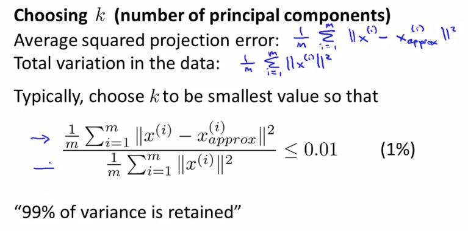

> # Machine Learning

- Instructor: Andrew Ng
- Lectures: [Coursera](https://www.coursera.org/learn/machine-learning?action=enroll)
- [Sub-link](https://www.coursera.org/lecture/machine-learning/model-representation-db3jS?utm_source=link&utm_medium=in_course_lecture&utm_content=page_share&utm_campaign=overlay_button)

---

### dimension reduction

- (unsupervised) data에 바라는 건 한 가지, data를 설명할 수 있는 선(model)을 찾는 것.
- 입력 변수가 많아지면 많아질수록 이들이 구성하는 data의 차원은 그 수만큼 많아지고, model을 구성하는 것도 힘들어지고, 관계를 파악하는 것도 힘들어진다.
- 이를 효율적으로 하고자 설명축을 재설정하고, 해석하고자 설명축을 원래 축으로 바꾸기도 한다.
- 대체로 결과를 시각화해 형태를 확인하고 이를 통한 model 해석을 중점적으로 다루기에 1 ~ 3차원으로 줄인다.

## PCA (Principal Component Analysis)

- compression algorithm
- 다차원(p)의 data로부터 거리를 최소화하는 선 또는 평면 나아가 (p-1) 차원의 hyper-plane을 찾는 것.
- projection error를 최소화 하면서 data를 설명하는 새로운 축을, 측면을 찾는 것.
- 이 hyper-plane을 이루는 축들을 설명축으로 설정해 data를 다른 측면에서 이해하고 해석한다.

#### main idea

- preprocessing: feature scaling, mean normalization (due to impact on external value)
- (특이값 분해를 통한) 고유 벡터를 찾고, 이 중 고윳값이 가장 큰 벡터를 첫번째 PC로 삼는다.
- 원하는 수만큼 PC를 구한다.

#### detail k-dimension

- k = n이라면, 어떤 정보도 잃어버리지 않는다.
- 당연히 k(< p)-차원으로 data가 투영(project)되므로 일부 data와 설명력을 잃어버린다.

- n까지의 PC를 구해서 전체적인 (공)분산 행렬을 구하고 이 값들을 더해 구성하면 편하다.
- 어느 정도의 설명력을 유지할 것인지는 당연히 분석가의 재량이다.
- 이렇게 새로운 축으로 투영된 data를 원래의 축으로 돌려 복원한다(근사값을 얻는다).

#### addition

- reduce memory/disk needed to store data
- speed up learning algorithm
- 효과적인 시각화를 위해 (k = 2 or 3) 사용하기도 한다.
- overfitting을 막고자 사용하기도 하나, 종속변수에 대한 설명력을 고려하는 것이 아니라서 regularization 대신 사용하는 건 추천하지 않는다.

---

elbow(-point)라는 건 결국 기울기가 급격하게 변하는 지점을 의미하고, 다시 말해 이차-미분값이 큰 지점을 찾으면 되는 것처럼 보이지만, 이차-미분의 골 값은 그보다 살짝 더 앞을 가리키기도 한다. 그래서 어려워.
