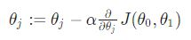
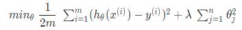
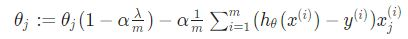
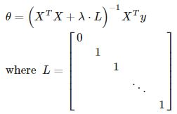
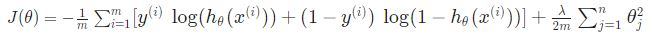

> # Machine Learning

- Professor: Andrew Ng
- Lectures: [Coursera](https://www.coursera.org/learn/machine-learning?action=enroll), [Sub-link](https://www.coursera.org/lecture/machine-learning/model-representation-db3jS?utm_source=link&utm_medium=in_course_lecture&utm_content=page_share&utm_campaign=overlay_button)

   

---

English version of modern definition of ML

> A computer program is said to learn from experence E with respect to some class of tasks T and perfomance measure P, if its perfomance at tasks in T, as measured by p, improves with experience E.
- Tom Mitchell (Carnegie Mellon University)

> Machine Learning은 매 만들어지고 사용하는 데이터를 뜻하는 경험(E)과 해당 경험을 위한 작업(T), 작업을 통해 얻어지는 perfomance의 측도인 성능(P)으로 구성된다.

- 학습 과제(well-posed learning problem) 중심 정의
- 경험이 증가함에 따라 작업을 수행하는 성능이 향상될 수 있다.
- 이런 것을 경험으로부터 학습(learn)했다고 표현한다.
- 이전 Arthur Samuel: ML이란 컴퓨터가 명시적 프로그램 없이 스스로 학습할 수 있는 능력을 공부하는 학문.

> Machine Learning is a field of study that gives computers the ability to learn without being explicitly programmed
- Arthur Samuel (1959)

- 모든 경우의 수를 프로그래머가 다 알아내어 프로그래밍하는 것은 사실상 불가능.
- 따라서 모든 경우의 수를 코딩하는 것이 아니라 특정 기준을 통해 상황을 정의하고 그에 따라 행동하자.

 

### Three compositions of ML

- contain Reinforcement

 

#### 지도 학습

Supervised Learning, learning with labeled examples

> In supervised learning, we are given a data set and already know what our correct output should look like, having the idea that there is a relationship between the input and the output.

- Supervised Learning means using data set includes correct outputs.
- Regression은 연속이라는 특징을 가진 값을 모형화하고 예측하려고 한다는 것을 뜻한다.
- Claasification은 연속하지 않은, 특히 범주적인 특징을 가진 값들에 대한 모형화와 예측을 시도하는 것이다.

| type detail                | example                                            |
| -------------------------- | -------------------------------------------------- |
| Regression                 | predicting final exam score based on time spent    |
| binary Clssification       | pass/non-pass based on time spent                  |
| Multi-label Classification | letter grade(A, B, C, D and F) based on time spent |

 

#### 비지도 학습

Unsupervised Learning, un-labeled data, grouping and clustering

> Unsupervised Learning allows us to approach problems with little or no idea what our results should look like. We can derive this structure by clustering the data based on relationships among the variables in the data.

- class 데이터가 없는 경우, 모두 같은 class인 경우, class라는 변수 자체가 없는 경우로 나뉜다.
- 따라서, unsupervised Learning grouping은 Clustering으로 몇 개의 group, 몇 개의 구조로 구성되어 있는지를 묻는 것이며 해당 구조체를 cluster라고 부른다.
- Organize computing clusters, Social network analysis, Market segmentation, Astronomial data analysis

 

> 음성 관련 clustering [W, s, v] = svd((repmat(sum(x.*x, 1), size(x, 1), 1).*x)\*x');
- Source: Sam Roweis, Yair Weiss & Eero Simoncelli

- svd( ): 특이값 분해(singular value decomposition)

   

---

### Basic configuration concepts of ML

|            용어            |                                                                                                                                                                  |
| :------------------------: | ---------------------------------------------------------------------------------------------------------------------------------------------------------------- |
|            가설            | h: hypothesis, 우리가 학습시켜 얻은 모델이자 모델의 수식 - h(x): X → Y, h maps from x's to y's                                                              |
|            모수            | parameter, 모델을 결정함에 따라 구해야 할 parameters도 결정된다.                                                                                                 |
| 비용 함수 (손실 함수) | Cost, Loss, J-func 모델 모수를 찾을 때 고려할 사항으로, 대체로 오차의 값을 최소화하는 회귀계수를 찾고자 한다. - LOSS: MSE or SSE(최소제곱법) and so on |
|            목표            | Goal is usually minimize Cost function                                                                                                                           |

- 생각해보면 ISLR 때부터 parameter 값의 변동에 의한 Loss 값의 그래프는 반복해왔던 거인데, 잘 몰랐다.
- Contour: 등고선 그래프의 일종, z값이 같은 이들을 연겷해 표현한 그래프
- 대체로 z축을 밀어넣어 2차원으로 필요한 등고선(contour line)만을 표시한다.
- Least Square를 사용하면 어떤 데이터든 볼록함수(Convex function)가 형성된다.

   

---

### Linear Algebra

| keyword                                            |                              |                               |
| -------------------------------------------------- | ---------------------------- | ----------------------------- |
| i-indexed in math                                  | 0-indexed in ML, pr.ming     |
| scalar                                             | (column) vector is n by 1    | row vector is 1 by n          |
| m by n matrix, \|Rm x n                 | M ij (sub matrix) | A ij (inner value) |
| not commutative                                    | 교환법칙이 성립하지 않는다.  |
| associative                                        | 결합법칙이 성립한다.         |
|                                                    |                              |                               |
| Transpose matrix, A', At, AT | n by m matrix                |
| Diagonal matrix                                    | all non-diagonals is 0       | 정사각행렬, 정칙행렬          |
| Identity matrix, I                                 | all diagonals is 1           | commutative                   |
| Inverse matrix, A-1                     | Determinant is not zero      | n by n matrix                 |
| Singular (or Degenerate) matrix                    | not inverse matrix           | Not all have an inverse       |

- Big alphbet vs. Small alphabet
- add only same dimension matrixes
- 행렬곱은 scalar와의 곱 말고는 앞-매트릭스의 열 수와 뒤-매트릭스의 행 갯수가 같아야 한다.
- 행렬 간의 곱은 그 계산과정에서 알 수 있듯이 ith 행벡터와 ith 열벡터의 곱을 나열한 모양이다.

   

---

### Gradient descent

> Start with some parameters(alpha, beta, gamma, delta etc) 
> Keep changing parameters to reduce Cost untill we hopefully end up at a minimum

- 경사 하강법
- 모델 학습에서 모든 경우를 고려하지 않고도 최적의 비용함수 값을 찾는 방법으로 널리 사용된다.
- 지역적 최솟값을 찾는 걸 방지하고자 다른 시작점을 두어 반복해 최적의 최솟값을 찾기도 한다.

 

<!-- > θj := θj − α \* ∂/(∂θj) \* J(θ0,θ1) -->

|         word         | description                                                                                                  |
| :------------------: | ------------------------------------------------------------------------------------------------------------ |
|  Learning Rate (α)   | 발걸음, 보폭으로 표현되며 얼마만큼 움직일지에 대한 측도 미분값의 얼마만큼의 비율로 움직일지에 관여한다. |
|    Local Optimum     | 지역적 최솟값, 경사 하강법을 통해 찾은 특정 부분의 극(소)값들                                                |
|    global optimum    | 전역적 최솟값, 극소값 몇몇의 Cost에는 지역적 최솟값 없이 전역적 최솟값만 있다.                          |
| simultaneosly update |

- 최소제곱법처럼 최적의 값을 찾기 위해 parameter마다 미분에서 최솟값을 구해야 한다.
- 수식과의 연계성을 고려해 parameter update는 모든 parameter를 한 번에 진행한다.
- As we approach a local minimum, gradient descent will automatically take smaller steps.
- If α is too large, gradient descent can overshoot the minimum. It may fail to converge, or even diverge.

- Batch Gradient descent: 집단 경사 하강법, Each step of gradient descent uses all the training examples.
- Normal Equations method: 반복 최소 이승법, 자료의 범위나 크기가 너무 거대해서 경사 하강법을 사용할 수 없을 때, 경사 하강법을 반복하지 않고 Cost의 최솟값을 구하는 방법

   

---

<!--
> Overfitting: If we have too many features, the learned hypothesis may fit the training set very well(cost is almost 0), but fail to generalize to new examples (predict prices on new examples).
-->

## Overfitting

|                   underfitting                    |                  overfitting                   |
| :-----------------------------------------------: | :--------------------------------------------: |
|                     과소적합                      |                    과대적합                    |
|     강한 편향, High bias (데이터 설명력 부족)     |                    low bias                    |
|                   low variance                    |  높은 분산, High variance (모델 예측력 부족)   |
|            강한 선입견(preconception)             |              not generalize well               |
| 데이터랑 모양이 다른 경우로 모델 평가가 형편없다. | 오차를 줄이는데 집중해서 변동성이 너무 커졌다. |

- 역사적으로 또는 기술적으로 정해진 이름들이라 조금 다르게 받아들여질 수 있다.

 

### 1. Reduce number of features

> Manually select which features to keep. 
> Model selection algorithm.

- 변수를 모델에서 제외하는 것은 해당 변수로만 설명 가능하던 response의 부분 정보을 버린다는 것과 같다.

 

### 2. Regularization

*정규화, 수축(shrink) 모수의 추가*

> Keep all the features, but reduce magnitude/values of parameters θj​. 
> Works well when we have a lot of features, each of which contributes a bit to predicting y.

<!--
- Small values for parameters θ -> "Simpler" hypothesis, Less prone to overfitting
-->

- 모델에 설명력이 약한 변수나 poly-term에 큰 수를 곱해 panalty로 cost-function을 구성하면, cost를 최소화시키기 위해 panelty term의 parameter는 0으로 수렴하게 되고, 이를 통해 해당 term을 모델에 넣지 않은 것 같은 효과를 낸다. 이것이 정규화의 핵심이다.
- 그러나 parameter의 값이 0으로 수렴할 뿐이지, 실제로 0의 값을 가지지는 못해 어떤 변수도 배제하지 않는다.

 

- λ (lambda, regularization parameter, 정규화 모수)
- θ0, y-절편의 값은 (x0 = 1이라) 모델 수축(단순화)에 영향력을 행사하지 못하므로 summation에 들어가지 않는다.
- θ0를 summation에 추가하는 작은 차이가 단위에 따라 큰 차이를 만들 수 있습니다.

|            |     λ가 너무 작으면      |         λ가 너무 크면          |
| :--------: | :----------------------: | :----------------------------: |
| J(θ), cost |   MSE term이 좌지우지    | regularization term이 좌지우지 |
| 변수 갯수  | 필요 없는 변수 제거 불가 |    모든 변수를 없애는 결과     |
| 결과적으로 |       overfitting        |          underfitting          |

 

1. Gradient descent

- Regularization term으로 인해 절편을 제외한 모든 θ가 learning rate term 이전에 θ(1 - α\*λ/m)이 된다.
- θ에 곱해지는 수는 α\*λ가 양수 소숫값이라 1보다 약간 작은 숫자가 된다.

 

2. Normal Equation (Non-invertibility)

- regualization을 하는 가장 큰 이유는 적절한 회귀계수의 선정과 overfitting을 피하고자 함이다.
- 따라서, Normal Equation에는 이전과 같은 regualization은 필요가 없다.
- 그러나 singular matrix가 되면 안 되기에 약간의 값을 추가해주는데, 이 모양이 regualization term과 유사하다.

 

(addtion) logistic regression (gradient descent)

