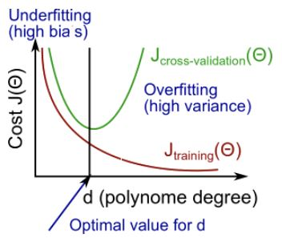
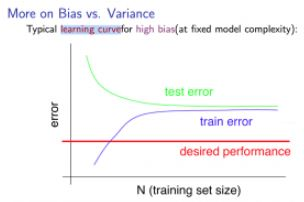
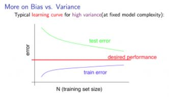

> # Machine Learning

- Instructor: Andrew Ng
- Lectures: [Coursera](https://www.coursera.org/learn/machine-learning?action=enroll)
- [Sub-link](https://www.coursera.org/lecture/machine-learning/model-representation-db3jS?utm_source=link&utm_medium=in_course_lecture&utm_content=page_share&utm_campaign=overlay_button)

---

모델 Cost 줄이기

- Get more training examples: fixes high variance
- Try smaller sets of features: fixes high variance
- Try getting additional features: fixes high bias
- Try adding polynomial features: fixes high bias
- Try decreasing lambda: fixes high bias
- Try increasing lambda: fixes high variance

어떤 것이 정확할지는 모르기 때문에 모델 진단(diagnostic)을 통해 모델을 확인한다.
당연히 시간이 걸리는 작업이지만, 모델의 신뢰성을 확인할 수 있는 부분이기에 하는 것을 추천한다.

---

## Train vs. Test

학습되어 정해지는 모수(회귀계수 등)와 달리 모형의 형태를 결정 짓는 hyper-parameter

- Train-test approach: Train(70) vs. Test(30)
- Validation set approach: Train(60) vs. Validation(20) vs. Test(20)
- CV (Cross Validation set): Train + Validation에서 지속적으로 새로운 Validation set과 그의 여집합 Train을 통해 hyper-parameter는 거듭 조정한다.

|    concept    | description                                                                                                                                                                           |
| :-----------: | ------------------------------------------------------------------------------------------------------------------------------------------------------------------------------------- |
|  train error  | 모델 적합에 사용된 데이터로 구한 오류율 - overfitting 되면 될수록 값이 작아진다.                                                                                                 |
|  test error   | 모델 적합에 사용되진 않았지만, train set과 같이 구해진 (임의로 추출된) 데이터로 구한 오류율 - polynomial 차수가 증가할수록 줄어들다가 일정 수준을 지나면 다시 증가하기 시작한다. |
|               |                                                                                                                                                                                       |
|   High Bias   | (underfit) train, test error가 크지만, 비슷하다.                                                                                                                                      |
| High Variance | (overfit) train error가 작은데 반해 test error는 크다.                                                                                                                                |
 
<table>
  <tr>
    <td colspan="2"></td>
  </tr>
  <tr>
    <td></td>
    <td></td>
  </tr>
</table>

---

### Regularization

- polynomial 차수가 크면 클수록 큰 panelty을 주며, 이를 통해 차수가 큰 변수의 영향을 감소시킨다.
- The Lasso에 경우, 더 나아가 미미한 영향력을 행사하는 항을 지우게 한다.
- Andrew Ng께선 lambda를 0, 0.01, 0.02, 0.04, 0.08, 0.16, 0.32, 0.64, 1.28, 2.56, 5.12, 10(원래라면 10.24지만)로 총 12개를 기준으로 사용하신다고.
- lambda가 커지면, 자연스럽게 underfitting 되는 거지, 맞다.

---

Model Complexity Effects

- Lower-order polynomial (low model complexity) have high bias and low variance. In this case, the model fits poorly consistensity.
- Higher-order polynomial (high model complexity) fit the training data extremely well and the test data extremely poorly. These have low bias on the training data, but very high variance.
- In reality, we would want to choose a model somewhere in between, that can generalize well but also fits the data resonably well.

---

### Precision & Recall

|      concept       | description                           |
| :----------------: | ------------------------------------- |
|      accuracy      | true / total examples                 |
| Precision (정확도) | True positive / predicted as positive |
|  Recall (민감도)   | True positive / prediction success    |

- 당연히 theshold 값을 높이면 높일수록 정확도는 높아지겠지만, 민감도는 바닥을 칠 것이다.
- 그러면 많은 수의 actual positive를 놓치는 것이고, 좋은 classifier가 되지 못한다.
- avoid false negativea.

precision과 recall을 적당히 크게 하는 threshold 찾기

- average 이용: (precision + recall)/2, 당연히 극값의 영향을 받아 쓸모가 없다.
- <i>F1 Score = 2PR / (P+R)</i>
